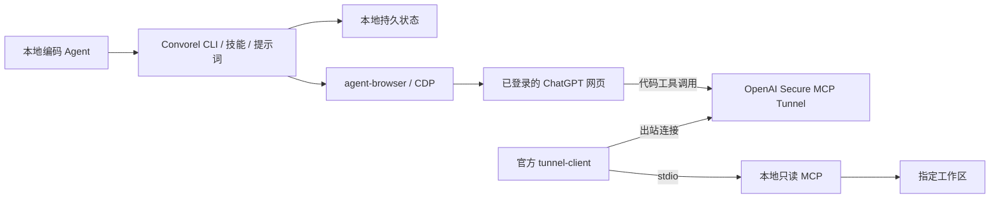

# Convorel

**让本地编码 Agent 与网页 AI 接力协作。**

[](https://github.com/MarioJames/convorel/actions/workflows/check.yml)
[](LICENSE)

Convorel 把已登录的 ChatGPT 网页接入本地开发流程：编码 Agent 提出问题，网页 AI 给出独立意见，再由本地 Agent 核对、修改和运行测试。需要代码证据时，ChatGPT 可以通过 MCP 按需读取你指定的工作区。

会话、请求、回复和标签页归属都保存在本地。进程中断后可以继续核对同一轮消息；完成后只清理自建且确认空闲的标签页，保留浏览器和登录状态。

[快速开始](#快速开始) · [接入指南](docs/quickstart.md) · [架构](docs/architecture.md) · [访问边界](docs/security.md) · [验证记录](docs/validation.md)

## 能做什么

- **网页协作**：通过内置的 agent-browser 和 CDP 使用你自己的 Chrome，发送问题前核对模型。
- **只读代码访问**：提供工作区信息、目录、文件、文本搜索、Git 状态和 diff 六个 MCP 工具。
- **可恢复的对话**：绑定任务、会话和精确消息 ID，保存完整提示词与最终回复；发送结果不确定时不自动重发。
- **标签页管理**：绑定指定标签页，保护用户已有页面、草稿和新轮次；不因重连反复创建空白页。
- **内置审查提示词**：要求核对工作区、引用文件与 hash，并区分事实、风险和建议。
- **Agent 技能与初始化**：一个入口安装项目依赖、初始化配置、安装技能并检查连接。

适合架构讨论、代码审查和实现方案交叉验证。编码与测试仍由本地 Agent 完成；远端回复是需要核实的审查意见。

## 两条独立通道



| 使用方式            | 需要什么                                                       | ChatGPT 能看到什么         |
| ------------------- | -------------------------------------------------------------- | -------------------------- |
| 网页对话            | 已登录浏览器、CDP、可用模型                                    | 你发送的提示词和上下文     |
| 网页对话 + 本地代码 | 上述条件，以及 tunnel-client、隧道凭据和 ChatGPT developer app | 指定工作区中允许读取的内容 |

**仅打开 CDP 不会启用代码访问。** 网页对话无需本项目使用 API key；隧道需要自己的 runtime API key。无需 OpenAI 桌面端、Herdr 或记忆服务，也不需要全局安装 agent-browser。

## 快速开始

首版支持 **Linux**，需要 Bun ≥ 1.3、Node ≥ 24、Git 和已安装的 Chrome/Chromium。当前仅实现 ChatGPT 网页适配。

### 1. 获取项目

```bash
git clone https://github.com/MarioJames/convorel.git
cd convorel
```

当前按源码安装使用，不假定 npm 包已经发布。

### 2. 准备浏览器

在另一个终端启动 Chrome，随后手动登录 ChatGPT；已有兼容的 CDP 浏览器可以直接复用。

```bash
google-chrome --remote-debugging-address=127.0.0.1 --remote-debugging-port=9222 \
  --user-data-dir="$HOME/.local/share/convorel-chrome" https://chatgpt.com
```

将 `google-chrome` 换成实际安装的浏览器命令。调试端口只绑定本机，并使用单独的持久化 profile；[Chrome 136+ 要求使用非默认数据目录](https://developer.chrome.com/blog/remote-debugging-port)。

### 3. 初始化并安装技能

在 Convorel 目录执行，将 `--workspace` 替换为准备共享的项目绝对路径：

```bash
bun --no-env-file setup.ts --workspace /absolute/path/to/your-project --cdp 9222
```

`setup` 会安装锁定的本地依赖，将配置写入 `~/.local/share/convorel/`，把内置技能链接到 `~/.agents/skills/convorel`，并检查 CDP 和本地 MCP。重复执行会保留已配置的可选偏好；同名技能冲突会报错，不覆盖原文件。源码目录需保留，以供技能调用。

默认核对页面模型 **6 Pro**。若账号没有此模型，可以在初始化时传入 `--model '页面上的模型名称'`，并在网页中手动选好；程序不会静默降级。所有源码 CLI 命令保留 `--no-env-file`，避免自动加载工作区的环境文件。

### 4. 发起第一次讨论

让支持本地技能的编码 Agent 使用已安装的 [Convorel 技能](skills/convorel/SKILL.md)，例如：

> 用 convorel 审查下面这份实现方案，取得回复后核对建议、保存总结，并清理自建标签页。

也可以直接使用 CLI。先创建一个不含敏感信息的请求文件：

```bash
CONVOREL_PROMPT_FILE=$(mktemp)
cat > "$CONVOREL_PROMPT_FILE" <<'PROMPT'
请审查这个方案：本地 Agent 负责编码和测试，网页 AI 提供独立审查。
列出两个主要风险和对应验证方法。本轮未提供代码，请只依据这段描述讨论。
PROMPT

bun --no-env-file src/cli.ts review start \
  --id first-review --prompt-file "$CONVOREL_PROMPT_FILE"
```

从输出中复制 `currentRun`，将下面的 `RUN_ID` 替换为该值：

```bash
bun --no-env-file src/cli.ts review wait --id first-review --run RUN_ID
bun --no-env-file src/cli.ts review result --id first-review --run RUN_ID
bun --no-env-file src/cli.ts review finish --id first-review --run RUN_ID
```

先消费、保存回复，再执行 `finish`。它保留会话链接和结果，只关闭经过核验的自有标签页；用户原有标签页不会关闭。

## 让 ChatGPT 读取本地代码

本地 MCP 使用 **stdio**，由 MCP 客户端或官方 tunnel-client 启动，不是浏览器直接访问的 HTTP 服务。

1. 安装官方 [tunnel-client](https://github.com/openai/tunnel-client/releases/latest)。
2. 在 [Platform 隧道设置](https://platform.openai.com/settings/organization/tunnels) 创建隧道，并关联目标 ChatGPT 工作区。
3. 配置自己的 runtime API key，然后生成并执行接入命令：

```bash
bun --no-env-file src/cli.ts tunnel instructions --tunnel-id YOUR_TUNNEL_ID
bun --no-env-file src/cli.ts tunnel doctor --tunnel-id YOUR_TUNNEL_ID
bun --no-env-file src/cli.ts tunnel run --tunnel-id YOUR_TUNNEL_ID
```

密钥在本机通过 `CONTROL_PLANE_API_KEY` 提供，不写入源码、提示词或任务 JSON。保持客户端运行，再在 ChatGPT 中创建并启用对应的 developer app。一个 stdio 隧道 ID 同时只能运行一个客户端。

完整凭据、权限和网页配置步骤见[接入指南](docs/quickstart.md#code-access-through-a-tunnel)与 [OpenAI 官方文档](https://developers.openai.com/api/docs/guides/secure-mcp-tunnels)。

| MCP 工具           | 用途                                  |
| ------------------ | ------------------------------------- |
| `workspace_info`   | 核对固定工作区身份与读取限制          |
| `list_directory`   | 列出允许访问的目录和文件              |
| `read_file`        | 按行读取文本，返回整文件 SHA-256      |
| `search_workspace` | 有扫描及输出上限的字面量文本搜索      |
| `git_status`       | 返回经过路径过滤的 Git 状态           |
| `git_diff`         | 读取工作区、暂存区或相对 HEAD 的 diff |

首次云端验证应使用内容已知的测试文件，让 ChatGPT 实际调用工具，再比对返回内容和 hash。`doctor` 的本地 MCP 成功不代表网页到本地代码的整条链路已接通。

## 续谈、恢复和多工作区

```bash
# 查看已保存的任务和轮次
bun --no-env-file src/cli.ts review list
bun --no-env-file src/cli.ts review status --id first-review --run RUN_ID

# 只观察现有消息，恢复中断后的状态，不再次点击发送
bun --no-env-file src/cli.ts review resume --id first-review --run RUN_ID

# 消费上一轮结果后，用新的请求 ID 继续同一对话
bun --no-env-file src/cli.ts review followup \
  --id first-review --prompt-file /path/to/followup.md --request-id round-2
```

重复相同任务和请求不会重发；新问题使用 `followup` 和新请求 ID。后续操作使用它返回的新 `currentRun`。等待超时只停止本地监视，不会停止网页生成。

一套状态目录绑定一个工作区和 CDP 地址。切换项目时，用 `CONVOREL_HOME` 选择另一个仓库之外的私有目录，并在后续命令中保持该设置：

```bash
export CONVOREL_HOME="$HOME/.local/share/convorel-project-b"
bun --no-env-file setup.ts --workspace /absolute/path/to/project-b --cdp 9222
```

代码访问边界不同的工作区使用独立隧道。自定义技能安装位置用 `setup --skill-dir DIR`；完整命令见 `bun --no-env-file src/cli.ts --help`。

## 验证与限制

当前首版本地验证已通过：38 项行为测试、TypeScript 检查、真实 Chrome 标签页回归、安装包验收，以及实际 ChatGPT 对话的发送、读取和整理。**ChatGPT → 隧道 → 本地代码的端到端验证尚未完成**，不能以本地 MCP 测试代替。完整环境和证据范围见[验证记录](docs/validation.md)。

- 只读 MCP 没有文件写入或任意 shell 工具；凭据文件、符号链接、硬链接和忽略路径受到限制，Git diff 同时检查重命名前后路径。
- `.convorelignore` 和 `.gitignore` 可以进一步收窄范围；文件名规则不能识别写在普通源码里的所有秘密。
- 同一连接的授权客户端共享指定工作区的读取范围；任务 ID 和工作区 hash 不承担远端鉴权。
- 文件实时读取，hash 用于标识观察到的内容，不承诺跨文件不可变快照。
- 网页 DOM、登录状态和平台权限可能变化；遇到验证挑战、草稿或不确定状态需要检查现场。

这是独立社区项目，不是 OpenAI 官方产品。分发源码不包含共享账号、隧道或公开 ChatGPT 插件。详细边界见[安全说明](docs/security.md)。

## 开发与贡献

```bash
bun install --frozen-lockfile
bun run check
bun run format:check
bun run test:browser --chrome /path/to/installed/chrome
bun run test:package
```

浏览器回归使用一次性 profile，不登录账号、不发送 ChatGPT 消息。安装包验收覆盖含空格路径、项目目录外调用、技能入口和真实 MCP stdio 读取。

欢迎通过 [Issues](https://github.com/MarioJames/convorel/issues) 提供复现或建议；开发约定见 [CONTRIBUTING.md](CONTRIBUTING.md)。

采用 [Apache-2.0](LICENSE) 许可证。复用来源及第三方许可见 [NOTICE](NOTICE) 和 [第三方声明](THIRD_PARTY_LICENSES.md)。
