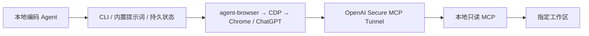

# Convorel

让本地编码 Agent 与网页 AI 接力协作：连接已有 Chrome 中的 ChatGPT 对话与只读代码 MCP，并保存可恢复的任务状态。

- **浏览器对话**：使用固定版本的 agent-browser，通过 loopback CDP 接管已登录的 Chrome。
- **本地代码**：官方 MCP SDK 提供目录、文件、搜索、Git 状态和 diff；通过 OpenAI Secure MCP Tunnel 供 ChatGPT 调用。
- **内置提示词**：要求工作区核对、代码证据、版本标记，以及阻断问题和可选建议的区分。
- **持久化任务**：保存会话 URL、精确消息/轮次、回复和 Tab 所有权；断线不自动重发。
- **可控清理**：只关闭已经保存结果、没有草稿和新消息的自有 Tab，保留浏览器和登录态。

这是独立社区项目，不是 OpenAI 官方产品。首版以 Linux + Bun 为验证环境，当前只实现 ChatGPT 网页适配。无需 OpenAI 桌面端；Herdr 和记忆服务不是依赖。

## 开始使用

源码安装（目前不假定 npm 包已经发布）：

```bash
bun --no-env-file setup.ts --help
```

启动自己安装的 Chrome，并手动登录 ChatGPT：

```bash
google-chrome --remote-debugging-address=127.0.0.1 --remote-debugging-port=9222 \
  --user-data-dir="$HOME/.local/share/convorel-chrome" https://chatgpt.com
```

Chrome 的调试模式需要单独的持久化 profile。已有兼容 CDP 浏览器可以直接复用，无需由本项目启动。

```bash
bun --no-env-file setup.ts --workspace /absolute/path/to/repo --cdp 9222
bun --no-env-file src/cli.ts review start --id architecture --prompt-file /path/to/request.md
bun --no-env-file src/cli.ts review wait --id architecture
bun --no-env-file src/cli.ts review result --id architecture
bun --no-env-file src/cli.ts review finish --id architecture --run RUN_ID
```

`setup` 安装锁定的项目依赖、写入私有配置、将内置技能链接到 `~/.agents/skills/`，并检查 CDP 与 MCP。用 `--skill-dir DIR` 自选安装位置；遇到已有同名文件会保留并报错。不会安装系统工具或创建云端资源。

`start` 返回 `currentRun`；将 `RUN_ID` 替换为它，清理必须传入 `--run`。`resume` 只核对已提交消息，不会重新发送；`followup` 显式开启下一轮。项目目录和模型由 `init` 配置。默认要求页面模型 `6 Pro`；若账号没有该模型，应显式配置可用模型，程序不会自动降级。

开启 CDP 可连接对话功能。**ChatGPT 读取本地代码还需要首次配置你自己的隧道和 ChatGPT developer app。**

```bash
bun --no-env-file src/cli.ts mcp serve --workspace /absolute/path/to/repo
bun --no-env-file src/cli.ts tunnel instructions --tunnel-id YOUR_TUNNEL_ID
```

`mcp serve` 使用 stdio，由 MCP 客户端或官方 tunnel-client 启动，不是浏览器访问的 HTTP 服务。隧道的 runtime key 只放在本机环境中。一个 stdio tunnel ID 同时只运行一个 tunnel-client。

完整操作见 [接入指南](docs/quickstart.md)。Agent 使用入口随包提供在 [SKILL.md](skills/convorel/SKILL.md)。

## 架构



编码和执行测试继续由本地 Agent 完成。网页端负责对话与审查，MCP 提供按需代码读取。用户配置保存在仓库之外；一套状态目录对应一个共享工作区。需要另一个工作区时使用独立的 `CONVOREL_HOME` 和隧道。

## 边界

- MCP 的文件名/ignore 策略不是通用密钥扫描器；允许的源码中若写入秘密，它仍可能被读取。
- 一个 connector 的授权范围是配置的工作区；task ID 不构成远程会话级鉴权。
- 文件是实时读取，返回 hash/时间信息；不宣称一次多文件审查是不可变快照。
- 网页 DOM、登录和平台权限会影响可用性；失败会保留诊断状态，不承诺绕过风控或 exactly-once 的远端发送。
- 开源软件分发不等于公开分发一个共享 ChatGPT 插件；每位用户配置自己的私有连接。

详见 [设计](docs/architecture.md)、[访问边界](docs/security.md)、[验证记录](docs/validation.md)。

## 开发

```bash
bun run check
bun run test:browser --chrome /path/to/installed/chrome
```

浏览器回归使用一次性本地 profile，不登录账号、不发送 ChatGPT 消息。实际网页及云端 MCP 验证另行记录，不能由 fixture 测试替代。

Apache-2.0。复用来源及第三方许可见 [NOTICE](NOTICE) 和 [第三方声明](THIRD_PARTY_LICENSES.md)。
