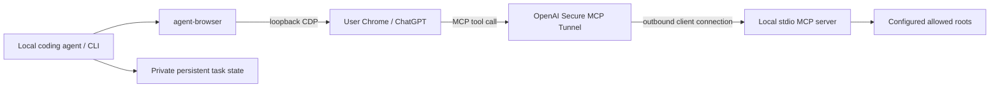

# Architecture and v0.1 decisions

Status: design reviewed in ChatGPT 6 Pro; local v0.1 implemented. The review assessed the proposal, without remote source access or test execution. Implementation evidence is tracked in validation.md.

## Product boundary

A local coding agent retains ownership of edits and tests. It talks to ChatGPT through the user's existing logged-in browser. ChatGPT can independently inspect the explicitly shared working directory through read-only MCP tools. This package provides the CLI, browser adapter, state, and MCP server. It does not include a model subscription, browser login, tunnel credentials, or hosted infrastructure.

Convorel owns the persistent conversation lifecycle and read-only code access. It is the source of truth for task-to-conversation bindings, runs, delivery/completion state, saved replies and owned browser resources. The `conversation` API creates or reuses a conversation, continues it across turns and process restarts, reconciles interrupted operations, persists messages/results and releases owned tabs. It prepends only a run correlation marker; it does not inject a persona, evidence rules, project paths or source contents. The independently maintained `chatgpt-review` skill owns review triggers, context selection, reviewer instructions, findings and decision gates. Setup and package distribution do not install that skill.

The caller explicitly selects a model when initializing state. Browser-side model verification is a transport precondition; choosing a review model is the caller's policy. Request IDs, run IDs, message/branch matching, private state and tab ownership remain service-level safeguards regardless of message purpose.

The two channels are independent. A browser-only conversation works without the tunnel. Code access requires a running tunnel-client and a configured ChatGPT developer app. Opening CDP alone does not configure MCP.

## Reuse

- Browser model checks and observed page extraction derive from `MarioJames/skill-foundry/skills/chatgpt-review` (Apache-2.0).
- `agent-browser` 0.34.0 remains the browser controller. CDP is its transport, not a second competing controller.
- The SDK v1 maintenance line is retained to match the inspected existing MCP design. It provides standard stdio framing, discovery and tool validation; we do not implement MCP JSON-RPC manually.
- Sensitive-file patterns draw from `XiaoDuoYa/codex-with-chatgpt` (MIT). Its desktop browser, Cloudflare and OAuth deployment are not copied.
- No mandatory Herdr or memory database. Stdout JSON and process exit status are the integration contract.

## Skills and service responsibilities

| Responsibility                                                                                                    | Owner                                                           |
| ----------------------------------------------------------------------------------------------------------------- | --------------------------------------------------------------- |
| Decide which task to initiate, its question/context, desired model/project and whether another question is needed | Skill / calling Agent                                           |
| Create/bind the remote conversation and persist its durable URL and configuration                                 | Convorel                                                        |
| Continue the same conversation after tab closure or process restart                                               | Convorel                                                        |
| Track request/run/message identity, delivery uncertainty, generation and completed replies                        | Convorel                                                        |
| Wait/reconcile, expose current status/results and preserve history                                                | Convorel                                                        |
| Apply requested title/project organization and safely release owned tabs                                          | Convorel                                                        |
| Interpret the answer, accept/reject findings and decide business completion                                       | Skill / calling Agent                                           |
| Keep the CLI wait process alive or deliver its notification                                                       | Calling runtime / Herdr; conversation state remains in Convorel |

A skill requests lifecycle operations; it does not implement a second conversation registry, browser ownership tracker or recovery state machine. Closing a task's tab is resource release, not deletion of the remote conversation or local history. `followup` restores the saved URL and verifies the preceding completed turn before creating its successor. `resume` reconciles a pending run; for an already completed run it returns the saved result without reopening a tab.

Lifecycle ownership does not promise that ChatGPT keeps a remote conversation forever or remains reachable. Login failures, remote deletion, changed branches and uncertain UI actions must produce explicit failure/pending states rather than silently creating a replacement conversation. This release uses explicit CLI calls and a foreground `wait` process; it does not claim a resident daemon, durable job scheduling or automatic business retries.

## Durable identities

- Workspace: canonical local root plus opaque hash; this is a routing identity, not authentication.
- Task: user-supplied stable ID, permanently mapped to one workspace and conversation.
- Conversation: validated ChatGPT conversation URL and ID; survives closed tabs.
- Browser binding: endpoint, browser epoch, target ID, ownership. It expires across browser restarts.
- Run: UUID, prompt marker/hash, observed user message ID, observed model, reply and terminal outcome.

A single atomic private task document stores its runs and binding, avoiding cross-file publication races. All mutations and browser side effects are serialized by a private state lock. No age-based stealing of a live owner's lock. Linux process start identity distinguishes PID reuse. Missing or corrupt lock metadata fails closed and requires inspection. Persistent state is not kept inside the shared code root.

## Sending and recovery

1. Persist the initial task, attempt and first prepared run together; never publish an empty task before its run. Record intent and unique request marker before submitting a browser action.
2. Check task identity, exact browser target, no active response and no unsent draft; verify configured model.
3. Fill and submit only once; record the observed message ID when visible.
4. Failures before Send remain `prepared` with their error; an explicit run-bound `retry` can continue only that unsent run after rechecking page/model/draft/prior history. `resume` only observes. If submission outcome is uncertain, retain that state. Reconcile by marker on the same conversation/owned draft. Never retry Send just because a command or wait timed out.
5. Match completion to the exact submitted user message, refuse a later user message and keep each run's reply.
6. On restart, use conversation identity to recover. An existing user tab is borrowed, never retroactively marked owned.

Browser UI cannot provide a transactional exactly-once send guarantee. The guarantee is no automatic second submission after an uncertain outcome, with explicit recovery evidence.

## Resource ownership

Select a target unpinned before enabling pinning, avoiding an implicit blank page. Never issue browser-wide close against the user's browser. Close only an owned, identity-matching, idle page after the current reply is saved and no draft exists. Tab release, reply completion and optional title/project organization are separate states. If the owned page is the last browser tab, record and create one inert keepalive before closing it; later operations preserve that tab.

## Code access

One stdio process binds a fixed allowed-root list. The server does not infer a trusted conversation ID from a prompt or task ID; all clients authorized to this connector can read its allowed workspace. Separate sensitive workspaces require separate connectors/tunnels or an independently authenticated server design.

Tools: workspace_info, list_directory, read_file, search_workspace, git_status, git_diff. No write_file or arbitrary shell tool. Fixed Git invocations disable external diff/textconv, fsmonitor, global config, lazy fetching and optional index updates; configured clean/process filters are refused; errors are failures, never a clean status.

All tools share path and ignore policy, including Git old/new rename paths. Files are bounded by size, response bytes and line ranges. Search is literal and bounded. Symlinks and non-regular files are refused. Root/workspace identity is checked when handling requests. Policies apply to filenames, not arbitrary secrets placed in ordinary source files; users must share only appropriate workspaces.

Reads observe the live filesystem. Per-file hashes and timestamps identify observed bytes. Git HEAD alone is not a snapshot of uncommitted work. Reviews must disclose changes during reading; immutable snapshots are outside v0.1.

## Distribution

A standalone Bun package with source, lockfile, CLI, tests, CI, architecture, security and setup docs. Linux is the initial validated platform. Package installation can include the pinned agent-browser binary without downloading a browser. Chrome and tunnel-client remain user-controlled prerequisites. Publishing npm/GitHub releases is separate from local implementation.

## Sources

- https://developers.openai.com/api/docs/guides/secure-mcp-tunnels
- https://github.com/vercel-labs/agent-browser
- https://github.com/modelcontextprotocol/typescript-sdk/tree/v1.x
- https://github.com/XiaoDuoYa/codex-with-chatgpt

## Review decisions incorporated

Keep a single package and atomic JSON state for v0.1. Reverse-check conversation/target claims across tasks; persist caller request keys and full prompts before submission. Bind operations to attempt/run identities, use a short global writer lock, and preserve uncertain delivery without resending. Cleanup rechecks exact user/assistant IDs, reply hash, branch, drafts and browser epoch. Apply one file policy to all MCP and Git routes, including deleted/renamed paths. Bind each live tunnel client to an explicit allowed-root list; retain one live native client per tunnel ID. All MCP requests select full paths within that fixed list. Disable Bun dotenv autoload on CLI/MCP entry points and test the packaged distribution outside the checkout.
