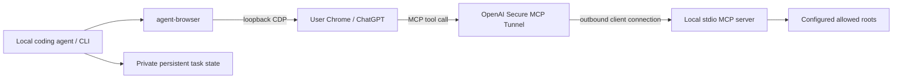

# Architecture and v0.1 decisions

Status: the bundled-skill boundary was reviewed with ChatGPT using read-only MCP evidence from the baseline and an in-progress diff. The reviewer did not run local tests or claim to validate the final revision. Implementation evidence and live-browser limits are tracked in validation.md.

## Product boundary

A local coding agent retains ownership of edits and tests. It talks to ChatGPT through the user's existing logged-in browser. ChatGPT can independently inspect the explicitly shared working directory through read-only MCP tools. This package provides the CLI, browser adapter, state, and MCP server. It does not include a model subscription, browser login, tunnel credentials, or hosted infrastructure.

Convorel owns the persistent conversation lifecycle and read-only code access. It is the source of truth for task-to-conversation bindings, runs, delivery/completion state, saved replies and owned browser resources. The `conversation` API creates or reuses a conversation, continues it across turns and process restarts, reconciles interrupted operations, persists messages/results and releases owned tabs. It prepends only a run correlation marker; it does not inject a persona, evidence rules, project paths or source contents. The bundled, independently installable `chatgpt-review` skill owns review triggers, context selection, reviewer instructions, findings and decision gates, including a bounded post-development comparison of the actual outcome against goals and architecture constraints. Result review does not default to a detailed code audit or full-log transfer. Bundling it does not inject review policy into the transport. The skill resolves a separately installed CLI through PATH or CONVOREL_BIN, never relative to its own installation directory.

The default model policy selects Latest with Power at its Pro endpoint, without pinning a version; callers can explicitly override it. Model and paired project settings resolve from process environment (including empty values), then the installation-root .env. New tasks snapshot their configuration; continuation keeps the existing snapshot. Browser-side model verification remains a transport precondition. Request IDs, run IDs, message/branch matching, private state and tab ownership remain service-level safeguards regardless of message purpose.

The two channels are independent. A browser-only conversation works without the tunnel. Code access requires a running tunnel-client and a configured ChatGPT developer app. Opening CDP alone does not configure MCP.

## Reuse

- Browser model checks and observed page extraction derive from `MarioJames/skill-foundry/skills/chatgpt-review` (Apache-2.0).
- `agent-browser` 0.34.0 remains the browser controller. CDP is its transport, not a second competing controller.
- The SDK v1 maintenance line is retained to match the inspected existing MCP design. It provides standard stdio framing, discovery and tool validation; we do not implement MCP JSON-RPC manually.
- Sensitive-file patterns draw from `XiaoDuoYa/codex-with-chatgpt` (MIT). Its desktop browser, Cloudflare and OAuth deployment are not copied.
- No mandatory Herdr or memory database. Stdout JSON and process exit status are the integration contract. Optional Herdr guidance is loaded from the skill reference only when needed and reuses the installed Herdr skill/CLI; an unresolved caller falls back to host processes or bounded waits. Notifications never replace an exact run-bound result.

## Skills and service responsibilities

| Responsibility                                                                                                    | Owner                                                           |
| ----------------------------------------------------------------------------------------------------------------- | --------------------------------------------------------------- |
| Decide which task to initiate, its question/context, desired model/project and whether another question is needed | Skill / calling Agent                                           |
| Create/bind the remote conversation and persist its durable URL and configuration                                 | Convorel                                                        |
| Continue the same conversation after tab closure or process restart                                               | Convorel                                                        |
| Track request/run/message identity, delivery uncertainty, generation and completed replies                        | Convorel                                                        |
| Wait/reconcile, expose current status/results and preserve history                                                | Convorel                                                        |
| Apply requested title/project organization and safely release owned tabs                                          | Convorel                                                        |
| Interpret the answer, accept/reject findings and decide business completion                                       | Skill / calling Agent                                           |
| Keep the CLI wait process alive or deliver its notification                                                       | Calling runtime / Herdr; conversation state remains in Convorel |

A skill requests lifecycle operations; it does not implement a second conversation registry, browser ownership tracker or recovery state machine. Closing a task's tab is resource release, not deletion of the remote conversation or local history. `followup` restores the saved URL and verifies the preceding completed turn before creating its successor. `resume` reconciles a pending run; for an already completed run it returns the saved result without reopening a tab.

Lifecycle ownership does not promise that ChatGPT keeps a remote conversation forever or remains reachable. Login failures, remote deletion, changed branches and uncertain UI actions must produce explicit failure/pending states rather than silently creating a replacement conversation. This release uses explicit CLI calls and a foreground `wait` process; it does not claim a resident daemon, durable job scheduling or automatic business retries.

自动命名使用 `MMDD｜TYPE｜Topic`，从远端 `createdAt` 转 `Asia/Shanghai` 得到日期，默认英文 TYPE，明确要求中文时使用 `organize --language zh`。无项目配置仍命名且不移动会话；有目标项目才核验授权归属。标题、项目整理和自有标签页释放分别记录结果，不能用 cleanup 成功掩盖组织失败。

## Durable identities

- Workspace: canonical local root plus opaque hash; this is a routing identity, not authentication.
- Task: user-supplied stable ID mapped to a workspace and conversation. Only an unsent initial prepared run permits explicit compare-and-rebind of workspace metadata; its prompt and run stay unchanged.
- Conversation: validated ChatGPT conversation URL and ID; survives closed tabs.
- Browser binding: endpoint, browser epoch, target ID, ownership. It expires across browser restarts.
- Run: UUID, prompt marker/hash, observed user message ID, observed model, reply and terminal outcome.

A single atomic private task document stores its runs and binding, avoiding cross-file publication races. All mutations and browser side effects are serialized by a private state lock. No age-based stealing of a live owner's lock. Linux process start identity distinguishes PID reuse. Missing or corrupt lock metadata fails closed and requires inspection. Persistent state is not kept inside the shared code root.

## Sending and recovery

1. Persist the initial task, attempt and first prepared run together; never publish an empty task before its run. Record intent and unique request marker before submitting a browser action.
2. Check task identity, exact browser target, no active response and no unsent draft; verify configured model.
3. Fill and submit only once; record the observed message ID when visible.
4. Failures before Send remain `prepared` with their error; an explicit run-bound `retry` can continue only that unsent run after rechecking page/model/draft/prior history. `resume` only observes. If submission outcome is uncertain, retain that state. Reconcile by marker on the same conversation/owned draft. Never retry Send just because a command or wait timed out.
5. Match completion to the exact submitted user message, refuse a later user message and keep each run's reply.
6. On restart, use conversation identity to recover. An existing user tab is borrowed, never retroactively marked owned.

An owned new page can restore an unrelated draft. `clear-draft` requires explicit authorization represented by the complete expected-draft file and the exact prepared run. It rejects conversation history, borrowed pages, attachments and uncertain delivery, persists a backup before editing, compares the observed page and draft inside the same synchronous browser operation, then verifies an empty editor with a second read. It does not submit. Recovery uses a browser editing deletion rather than setting a contenteditable element's synthetic `value` property; focus-triggered edits abort before deletion. Failures retain the run and backup for inspection.

`start --workspace` chooses a new task's snapshot; existing tasks reject conflicting workspace assertions. `status --workspace` diagnoses mismatches without page access, and `rebind-workspace` changes only prepared task metadata using an expected old binding. None of these operations changes allowed MCP roots or rewrites a saved prompt.

Browser UI cannot provide a transactional exactly-once send guarantee. The guarantee is no automatic second submission after an uncertain outcome, with explicit recovery evidence.

Send readiness and clicking use the same structural selector scoped to the composer form (`data-testid="send-button"` and `type="submit"`); visible text is not the locator. The composer button ID alone is insufficient because it can represent another action. Missing, ambiguous, disabled or obstructed controls prevent sending.

Observation failures do not erase confirmed message identity or roll a submitted run back to `prepared`. Runs retain the last successful page-read time and a separate observation error. The CLI `summary` projects those saved facts into delivery, phase and next-action fields; it is not another persistent workflow. Waiting makes at most three consecutive attempts on read/connection failures, with bounded delays, and never repeats a send action. Page identity and other attention conditions are not retried as transient transport failures. Reading local status succeeds independently of conversation completion; `resume` and `wait` report completion only when the exact run is complete.

## Resource ownership

Select a target unpinned before enabling pinning, avoiding an implicit blank page. Never issue browser-wide close against the user's browser. Close only an owned, identity-matching, idle page after the current reply is saved and no draft exists. Tab release, reply completion and optional title/project organization are separate states. If the owned page is the last browser tab, record and create one inert keepalive before closing it; later operations preserve that tab.

## Code access

One stdio process binds a fixed allowed-root list. The server does not infer a trusted conversation ID from a prompt or task ID; all clients authorized to this connector can read its allowed workspace. Separate sensitive workspaces require separate connectors/tunnels or an independently authenticated server design.

The evidence interface has twelve read-only tools: workspace_info, tree, find_files, read_file, search_workspace, read_image, git_status, git_diff, git_log, git_show, git_compare and git_read_file. Directory entries and rendering share tree; there is no separate directory-list tool. Each declares a strict object output schema matching its structured response. workspace_info exposes the service version, evidence capability revision and tool names as well as project identity, branch and Git availability. It does not infer task goals from source.

File discovery uses Bun's existing Glob matcher against the permission-filtered inventory. Literal content search accepts a directory scope and file pattern, returns context and hashes, and distinguishes pagination from scan/depth limits and unreadable files. Text reports reuse read_file; read_image returns bounded native MCP PNG/JPEG/WebP content through the same policy. Reports and screenshots remain caller-provided evidence: their bytes and observation times do not certify execution, originating revision or test success. No report registry or additional private-state access is introduced.

Git history resolves revisions to commit IDs before reading. Commit enumeration uses rev-list and cat-file rather than log presentation, so repository signature-display settings do not invoke a signature verifier. Commit details, endpoint/merge-base comparisons and historical blobs form a connected historical reading path; a clean worktree does not imply no recent commits. File pages and single-file patch fragments have separate continuations. Current and historical ignore policies constrain historical reads and both endpoints/names of differences. Fixed Git invocations disable replacement objects, external diff/textconv, fsmonitor, global config, lazy fetching and optional index updates; configured clean/process filters are refused. Errors are failures, never a clean status. No write_file, command execution, test runner or dependency-graph service is exposed.

Responses identify the observed scope and provide the applicable timestamp, file/patch hash or immutable revision, filtering/scan limits and continuation. Structured JSON is capped at 64 KiB; image bytes have a separate 1 MiB ceiling. Requests exceeding process budgets fail explicitly. The skill prepares goals, architecture constraints, baseline, actual outcome and verification summary; the transport continues to own only durable conversation facts.

All tools share path and ignore policy, including Git old/new rename paths. Files are bounded by size, response bytes and line ranges. Search is literal and bounded. Symlinks and non-regular files are refused. Root/workspace identity is checked when handling requests. Policies apply to filenames, not arbitrary secrets placed in ordinary source files; users must share only appropriate workspaces.

Reads observe the live filesystem. Per-file hashes and timestamps identify observed bytes. Git HEAD alone is not a snapshot of uncommitted work. Reviews must disclose changes during reading; immutable snapshots are outside v0.1.

## Distribution

A standalone Bun package with source, lockfile, CLI, the chatgpt-review skill and references, tests, CI, architecture, security and setup docs. The skills install command wraps the pinned skills@1.6.0 CLI against this installation’s local skills directory, supports Codex/Claude Code individually or together and user/project scope (default user), and rejects pre-existing same-name canonical or selected-Agent destinations before installation. It runs before State/config initialization and verifies the installed entry point. setup optionally installs after initialization and before doctor when --agent is supplied. Skills CLI can also install the skill independently; neither route requires a runtime adjacent to the skill. Linux is the initial validated platform. Package installation can include the pinned agent-browser binary without downloading a browser. Chrome and tunnel-client remain user-controlled prerequisites. Publishing npm/GitHub releases is separate from local implementation.

## Sources

- https://developers.openai.com/api/docs/guides/secure-mcp-tunnels
- https://github.com/vercel-labs/agent-browser
- https://github.com/modelcontextprotocol/typescript-sdk/tree/v1.x
- https://github.com/XiaoDuoYa/codex-with-chatgpt

## Review decisions incorporated

Keep a single package and atomic JSON state for v0.1. Reverse-check conversation/target claims across tasks; persist caller request keys and full prompts before submission. Bind operations to attempt/run identities, use a short global writer lock, and preserve uncertain delivery without resending. Cleanup rechecks exact user/assistant IDs, reply hash, branch, drafts and browser epoch. Apply one file policy to all MCP and Git routes, including deleted/renamed paths. Bind each live tunnel client to an explicit allowed-root list; retain one live native client per tunnel ID. All MCP requests select full paths within that fixed list. Disable Bun dotenv autoload on CLI/MCP entry points and test the packaged distribution outside the checkout.

`recover-send` is a separate, explicit exception for a blocked followup whose optimistic user message disappeared after an operator-verified Cloudflare challenge rejected the send POST. It requires the exact saved input, old user ID and URL, unique sanitized 403 evidence and timestamp, explicit challenge confirmation and reason, the original owned target in the same browser epoch, an empty idle composer, and the intact previous completed turn. It never opens or rebinds a page. Before one send, it durably records the old user/attempt and rejection evidence, preserving task/run/prompt identity. Uncertain sends do not become prepared; ordinary retry/resume semantics remain unchanged. See the recovery contract in [usage.md](usage.md). Network responses are not currently observed by the Browser adapter, so DOM recognition remains weaker than server acceptance.
