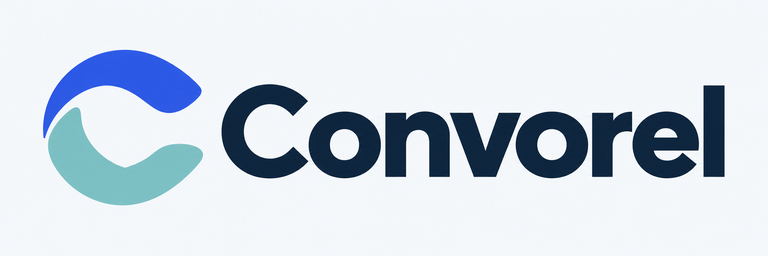
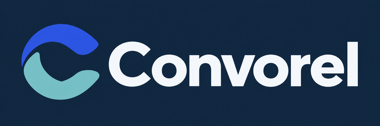
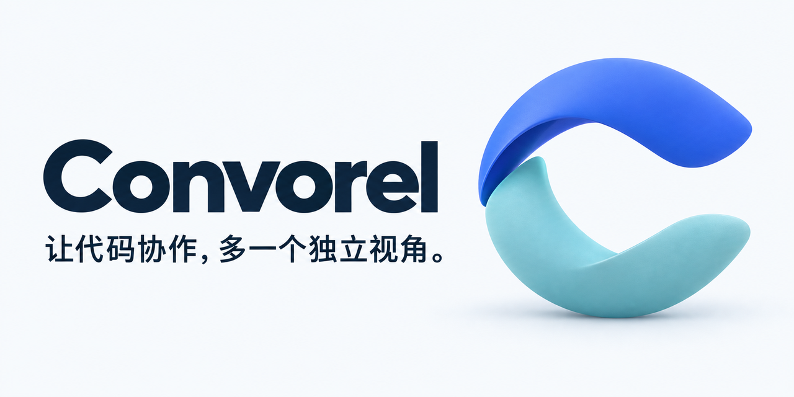

# Convorel 品牌素材包 v2

**让代码协作，多一个独立视角。**

Convorel 让编码 Agent 与 ChatGPT 围绕真实代码持续协作，将独立意见带回本地实现与验证。

## 设计方向

两条独立弧带组成向右开放的 C，表达独立视角与持续协作。图标采用简化的平面轮廓，封面使用同一轮廓的立体表达。名称统一写作 **Convorel**；命令与包名写作 `convorel`。

## 素材与尺寸

尺寸均为实际像素；文件名含完整宽高。所有尺寸均由对应母版等比例缩小，不裁切、不拉伸、不放大。

| 目录                | 版本                                                                | 尺寸                                                        |
| ------------------- | ------------------------------------------------------------------- | ----------------------------------------------------------- |
| `icons/`            | `transparent` 透明底、`light` 浅色底、`dark` 深色底                 | 16、24、32、48、64、128、180、192、256、512、1024 px 正方形 |
| `icons/favicon.ico` | 透明图标，多尺寸 ICO                                                | 内含 16、32、48、64 px                                      |
| `lockups/`          | `transparent` 透明底深色字、`light` 浅色底深色字、`dark` 深色底白字 | 192×64、384×128、768×256、1536×512                          |
| `social/`           | 浅色品牌封面，含中文主张                                            | 1200×600、1280×640、1600×800                                |
| `masters/`          | 7 张 imagegen 原始母版                                              | 图标 1254×1254；横向 Logo 2172×724；封面 1774×887           |

PNG 共 55 张，另含 1 个 ICO。`manifest.json` 记录每张 PNG 的尺寸、透明状态、字节数与 SHA-256。生成方式与完整提示词见 [PROMPTS.md](PROMPTS.md)。

## 使用选择

- 浏览器图标：`icons/favicon.ico`；在高分辨率屏幕上优先使用足够像素的 PNG。
- 项目头像：`icons/convorel-mark-light-512x512.png` 或深色底同尺寸版本。
- 移动端快捷方式：180 px 浅色底版本可作为 touch icon；192/512 px 可用于普通图标。保留默认图标用途，不把现有留白视为已验证的 maskable 安全区。
- 浅色页面：透明底深色字横向 Logo；显示宽度为 384 CSS px 时使用 768 px 文件。
- 深色页面：深色底白字横向 Logo，或透明独立图标。透明深色字版本不适合直接放在深色底上。本套未交付白字透明 Logo。
- README、介绍文档与分享：2:1 封面。平台要求其他比例时保留完整画面并增加留白，不拉伸文字。

## 配色与字体

| 颜色   | 色值      | 用途               |
| ------ | --------- | ------------------ |
| 深蓝   | `#14263D` | 主要文字、深色背景 |
| 钴蓝   | `#3458DB` | 上弧带、主强调色   |
| 海玻璃 | `#7CB8BE` | 下弧带、辅助强调色 |
| 雾白   | `#F5F8FB` | 浅色背景、深底文字 |
| 白色   | `#FFFFFF` | 正文页面与留白     |

这些色值是界面与排版使用的设计目标。AI 生成的栅格图存在轻微色差与纹理，不保证每个像素严格等于目标色值。正文沿用平台中文无衬线字体，英文标题使用清晰的无衬线字形；Logo 字标已经栅格化，不要求额外安装字体。

## 留白与最小尺寸

保留文件自带留白，外部文字和其他图形不进入留白区。不改变长宽比，不拆开弧带，不给标记加描边、阴影或额外文字。界面图标通常优先使用 24 px 及以上；16 px 仅用于 favicon 等受限场景，细小间隙会有所简化。横向 Logo 的建议最小显示宽度为 192 px。

## 交付验证与范围

已核对名称与中文主张、图形方向、明暗版本可读性，并检查全部 PNG 能正常解码、尺寸正确、透明版本含真实 Alpha、不透明版本无透明区域，以及 ICO 的四档尺寸。透明独立图标与横向 Logo 在边角保持完全透明。未通过视觉检查的浅色字标透明尝试不在包内。

交付格式为栅格 PNG/ICO，不包含可编辑 SVG、字体源文件或印刷 CMYK 文件。生成式版本之间存在细微轮廓差异，不应将不同背景版本叠放作逐像素切换。

素材遵循仓库 Apache-2.0 许可证。Convorel 是独立社区项目；不得利用这些素材暗示 OpenAI 的官方合作或背书。
