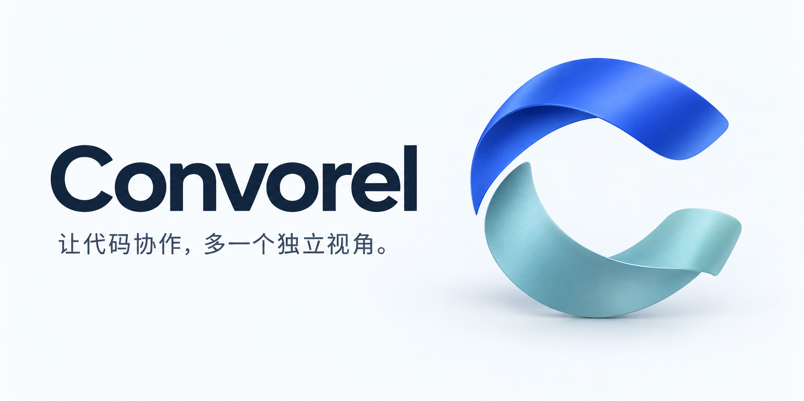

# 品牌与项目介绍

## 项目定位

Convorel 让编码 Agent 与 ChatGPT 围绕真实代码持续协作，将独立意见带回本地实现与验证。

面向已经使用 Codex、Claude Code 等编码 Agent，也希望借助 ChatGPT 讨论方案、审查修改或排查复杂问题的开发者。项目的核心价值是把讨论接入实际开发流程，并保留可继续、可核对的上下文。

### 品牌主张

> 让代码协作，多一个独立视角。

### 简短介绍

适用于仓库简介、项目目录和分享说明：

> 让编码 Agent 与 ChatGPT 围绕真实代码持续协作，将独立意见带回本地实现与验证。

### 完整介绍

Convorel 是一个开源的 AI 代码协作工具，将 ChatGPT 接入本地编码 Agent 的工作流程。Agent 整理问题并发起讨论，ChatGPT 提供独立意见，本地再核对建议、修改代码和运行测试。配置只读代码连接后，ChatGPT 可以按需查看授权目录中的文件和 diff；持久化会话让讨论能随着工作继续。

## 视觉素材

| 素材                                  | 用途                                         |
| ------------------------------------- | -------------------------------------------- |
| [品牌封面](assets/convorel-cover.png) | README 页首、项目介绍和横向分享图，比例 2:1  |
| [独立标记](assets/convorel-mark.png)  | 正方形项目图标、素材展示，使用不透明浅色背景 |

两条独立的弧带组成开放的 C：保持各自的视角，也能接续同一项工作。留白是标记的一部分。完整封面左对齐名称和主张，右侧承载标记；其余文档保持简单，让真实的使用场景承担说明工作。

| 颜色   | 色值      | 角色           |
| ------ | --------- | -------------- |
| 深蓝   | `#14263D` | 名称与主要文字 |
| 钴蓝   | `#3458DB` | 主标记与重点   |
| 海玻璃 | `#7CB8BE` | 第二条弧带     |
| 雾白   | `#F5F8FB` | 素材背景       |
| 白色   | `#FFFFFF` | 文档背景与留白 |

名称统一写作 **Convorel**；CLI 和包名保留 `convorel`。标题采用清晰的无衬线字形，中文内容优先使用系统中文无衬线字体。现有图片中的文字已栅格化，仓库不分发字体文件。

保持图片比例和四周留白，不拉伸、不拆开弧带、不在标记上叠加文字。深色页面使用图片自带的浅色底，不将其误作透明图。封面的主张在 README 正文中也有文字说明，不依赖图片传达功能或安装步骤。

这组素材使用 imagegen 生成并经视觉检查，原始 PNG 保存在仓库内。使用遵循仓库的 [Apache-2.0 许可证](../LICENSE)，不要据此暗示 Convorel 或 OpenAI 对衍生项目的背书。

## 表达原则

- 先说明开发者要完成的工作，再解释实现方式。CDP、MCP 和任务状态属于接入与架构文档。
- 用真实行为表达可靠性：保存上下文、核对消息、限制读取范围、保留不确定现场。
- 区分模型意见与本地验证。避免“保证正确”“完全自动”“零风险”等未经证实的承诺。
- 清楚说明当前支持范围与前置条件，不把尚未验证的平台或集成写成现有能力。
- 保持独立社区项目身份，不使用第三方标识制造官方合作印象。

GitHub 仓库简介可使用上面的简短介绍；社交预览可使用品牌封面。仓库中提供的是可用素材，不会自动修改远端仓库设置。
