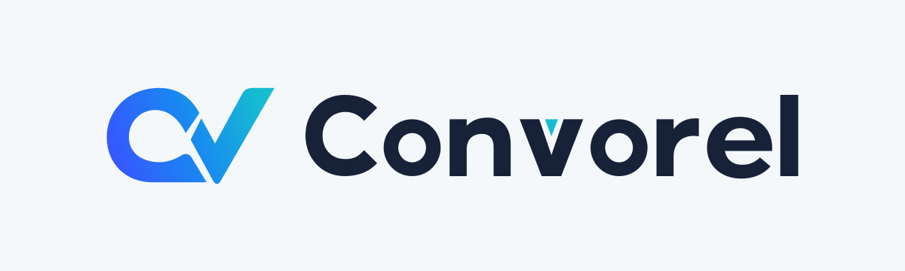
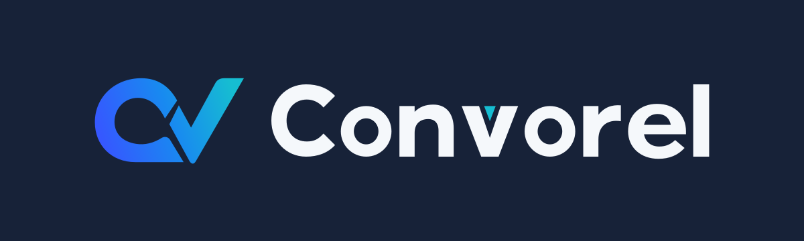
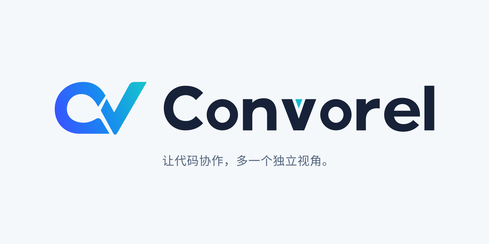

# 品牌与项目介绍

## 项目定位

Convorel 让编码 Agent 与 ChatGPT 围绕真实代码持续协作，将独立意见带回本地实现与验证。

面向已经使用 Codex、Claude Code 等编码 Agent，也希望借助 ChatGPT 讨论方案、审查修改或排查复杂问题的开发者。项目的核心价值是把讨论接入实际开发流程，并保留可继续、可核对的上下文。

### 品牌主张

> 让代码协作，多一个独立视角。

### 简短介绍

> 让编码 Agent 与 ChatGPT 围绕真实代码持续协作，将独立意见带回本地实现与验证。

### 完整介绍

Convorel 是一个开源的 AI 代码协作工具，将 ChatGPT 接入本地编码 Agent 的工作流程。Agent 整理问题并发起讨论，ChatGPT 提供独立意见，本地再核对建议、修改代码和运行测试。配置只读代码连接后，ChatGPT 可以按需查看授权目录中的文件和 diff；持久化会话让讨论能随着工作继续。

## 视觉素材

采用「CV 连字＋定制 Convorel 字标」：C 的弧形主体与 V 的斜向笔画组成独立 icon，交接处保留清晰切口。蓝青渐变从 C 延伸到 V，直接关联品牌名称。带 brand 版本在右侧排列完整 Convorel 字标，延续候选定制字形中的 C 斜切端点、几何圆形字腔与 v 内青色切口。

只保留以下四件成品。全部为真正的 SVG 矢量，不嵌入位图、不加载外部资源，文字已转为路径；可按使用场景缩放，无需重复保存多档尺寸。

| 素材                                           | 背景 | 用途                          |
| ---------------------------------------------- | ---- | ----------------------------- |
| [CV icon](assets/convorel-mark.svg)            | 透明 | 项目图标、头像、应用内标记    |
| [浅底横向字标](assets/convorel-logo-light.svg) | 雾白 | 浅色页面、文档与品牌介绍      |
| [深底横向字标](assets/convorel-logo-dark.svg)  | 深蓝 | 深色页面与演示                |
| [品牌封面](assets/convorel-cover.svg)          | 雾白 | README 与横向介绍，含中文主张 |







## 配色与排版

| 颜色           | 色值                          | 用途               |
| -------------- | ----------------------------- | ------------------ |
| 钴蓝 → 蓝 → 青 | `#3657FF → #188AF0 → #16BDD1` | CV 连字的统一渐变  |
| 青色           | `#16BDD1`                     | 定制 v 的内部切口  |
| 深蓝           | `#172238`                     | 字标、深色背景     |
| 雾白           | `#F5F8FB`                     | 浅色背景、反白字标 |
| 灰蓝           | `#52647D`                     | 中文主张           |

名称统一写作 **Convorel**；CLI 和包名保留 `convorel`。Convorel 字标的八个字符按选中的定制字标方向绘制为几何路径，统一字重、间距与切口；这是品牌字标，不是另行分发的字体。封面中文沿用已经转为路径的 Noto Sans CJK SC 字形，成品不分发或依赖字体文件。正文仍优先使用系统中文无衬线字体。

CV icon 的 viewBox 为 512×512；横向字标为 1200×360；封面为 1400×700。这些是构图比例，不是导出尺寸限制。主标记可在浅底、深底使用，常规界面建议 24 px 以上，16 px 仅用于受限位置；横向字标建议显示宽度至少 192 px。

保持画面比例和自带留白，不拉伸，不合并 C 与 V 的交接切口，不改成不透明白缝，不加立体材质或重阴影。深色页面优先使用深底字标。需要单色印刷时，C 与 V 可使用同一实色，但必须保留负形切口。

SVG 是本套源文件；只接受 PNG/JPEG 的发布平台需要按其实际规格导出，本仓库不再预存多尺寸副本。

## 生成与验证

概念探索使用内置 imagegen。用户选择 02「CV 连字」并要求复用 03「定制字标」后，以 SVG 原生路径和线性渐变重建 icon 与字标，并统一所有组合中的几何与颜色。最终文件没有嵌入生成图片，也没有 SVG 滤镜或外部字体依赖。

已通过浏览器检查：主标记在浅深背景的 16 / 24 / 32 / 64 / 144 px 显示、两款横向字标、封面中英文排版；同时检查 SVG 结构和本地引用。旧的对话负形方案、六张字母候选稿及此前的多尺寸副本均已清理，只保留四件正式 SVG。

<details>
<summary>imagegen CV 连字概念的完整提示词</summary>

```text
Use case: logo-brand
Asset type: one professional Convorel logo concept, a flat vector-friendly brand identity presentation.
Brand: Convorel connects local coding agents with independent AI discussion. The user wants an immediately brand-linked shape, not an arbitrary generic symbol. Completely fresh exploration; do NOT reuse previous two-arc ribbons, diagonal two-chat-panel logo, polygon C badge, or converging-arrow mark.
Presentation: pristine opaque white wide 2:1 canvas, one centered horizontal logo lockup with generous whitespace. Exact brand spelling "Convorel", C-o-n-v-o-r-e-l, capital C only. Typography should be carefully drawn, contemporary, clean and optically kerned, medium or semibold rather than heavy black. Symbol and typography must feel designed together. Deep ink navy #172238 lettering, restrained cobalt #315CF6 and cyan #27B4CA accent; simple flat fills or a very subtle controlled blue gradient only. Shape and spacing are more important than effects. Professional Swiss-influenced brand design, strong 24px silhouette, economical paths.
Constraints: ONE concept per image, no explanatory text, numbering, tagline, mockup, application examples, board grid, textured paper, 3D, metal, glass, bevels, shadows, glow, decoration, AI star, brain, infinity, network nodes or third-party logos. No giant uppercase typography. Entire background fully opaque white.

Concept 02 — bespoke CV ligature. Design a compact elegant monogram that truly combines a curved C and a diagonal V into ONE coherent shape: the C's open right side is completed by a sharply drawn V stroke flowing down into the lower C terminal. C and V must both be legible; the V is a letterform, not a checkmark added inside a badge. The monogram is open and airy, not enclosed in a square/circle. Shared stroke weight, restrained corner rounding, one precise negative-space diagonal slit at the join. Refined flat blue-to-indigo coloration. Place exact Convorel wordmark alongside it in a slightly geometric sans serif whose v repeats the monogram's angle. Avoid knots, chain links, overlapping translucent ribbons, pointed shield or generic verification-check branding.
```

</details>

<details>
<summary>imagegen 定制字标概念的完整提示词</summary>

```text
Use case: logo-brand
Asset type: one professional Convorel logo concept, a flat vector-friendly brand identity presentation.
Brand: Convorel connects local coding agents with independent AI discussion. The user wants an immediately brand-linked shape, not an arbitrary generic symbol. Completely fresh exploration; do NOT reuse previous two-arc ribbons, diagonal two-chat-panel logo, polygon C badge, or converging-arrow mark.
Presentation: pristine opaque white wide 2:1 canvas, one centered horizontal logo lockup with generous whitespace. Exact brand spelling "Convorel", C-o-n-v-o-r-e-l, capital C only. Typography should be carefully drawn, contemporary, clean and optically kerned, medium or semibold rather than heavy black. Symbol and typography must feel designed together. Deep ink navy #172238 lettering, restrained cobalt #315CF6 and cyan #27B4CA accent; simple flat fills or a very subtle controlled blue gradient only. Shape and spacing are more important than effects. Professional Swiss-influenced brand design, strong 24px silhouette, economical paths.
Constraints: ONE concept per image, no explanatory text, numbering, tagline, mockup, application examples, board grid, textured paper, 3D, metal, glass, bevels, shadows, glow, decoration, AI star, brain, infinity, network nodes or third-party logos. No giant uppercase typography. Entire background fully opaque white.

Concept 03 — wordmark-first identity. NO separate symbol at all. Make the exact word "Convorel" itself the whole logo in an original beautifully crafted modern lowercase-and-capital sans serif: capital C, rest lowercase. Gently rounded counters, moderate weight, distinctive narrow diagonal notch at the lower-right terminal of the initial C and a precisely matched cut at the apex of the v. Fuse only the adjoining v-o relationship through exceptionally good spacing, not actual unreadable joined characters. The initial C is cobalt, the remaining letters deep ink navy, with a tiny restrained cyan facet confined to the v notch. The C can later stand alone as an icon. The brand has eight letters: C-o-n-v-o-r-e-l; render EXACTLY "Convorel" with all eight correct characters. No dropped letters or added characters. Large but comfortably framed, understated typographic craft, not a generic off-the-shelf bold font and not a sci-fi stencil.
```

</details>

素材遵循仓库的 [Apache-2.0 许可证](../LICENSE)。Convorel 是独立社区项目，不得利用这些素材暗示 OpenAI 的官方合作或背书。

## 表达原则

- 先说明开发者要完成的工作，再解释实现方式。CDP、MCP 和任务状态属于接入与架构文档。
- 用真实行为表达可靠性：保存上下文、核对消息、限制读取范围、保留不确定现场。
- 区分模型意见与本地验证。避免“保证正确”“完全自动”“零风险”等未经证实的承诺。
- 清楚说明当前支持范围与前置条件，不把尚未验证的平台或集成写成现有能力。
- 保持独立社区项目身份，不使用第三方标识制造官方合作印象。
