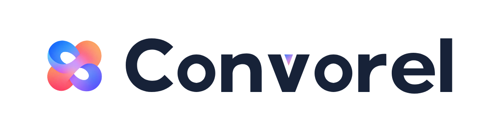

# 品牌与项目介绍

## 项目定位

Convorel 让编码 Agent 与 ChatGPT 围绕真实代码持续协作，将独立意见带回本地实现与验证。

面向已经使用 Codex、Claude Code 等编码 Agent，也希望借助 ChatGPT 讨论方案、审查修改或排查复杂问题的开发者。项目的核心价值是把讨论接入实际开发流程，并保留可继续、可核对的上下文。

### 品牌主张

> 让代码协作，多一个独立视角。

### 简短介绍

> 让编码 Agent 与 ChatGPT 围绕真实代码持续协作，将独立意见带回本地实现与验证。

### 完整介绍

Convorel 是一个开源的 AI 代码协作工具，将 ChatGPT 接入本地编码 Agent 的工作流程。Agent 整理问题并发起讨论，ChatGPT 提供独立意见，本地再核对建议、修改代码和运行测试。配置只读代码连接后，ChatGPT 可以按需查看授权目录中的文件和 diff；持久化会话让讨论能随着工作继续。

## 视觉素材

保留两款双叶回环标记，分别源自选中的 15 与 19。两款共用定制 **Convorel** 字标，名称、字重、间距保持一致。

- **交融版（expressive / 15）**：保留斜向穿插、不等形镂空和更有动感的轮廓；暖色位于左上、右下，冷色位于右上、左下。README 默认使用这一版。
- **均衡版（balanced / 19）**：两侧体量更规整；冷色位于左上、右下，暖色位于右上、左下。

每款只保留四个文件：选中原图的透明 PNG 母版、256×256 透明 PNG，以及白底横向品牌组合的 PNG / SVG。图标直接使用选中的原始位图，不重绘轮廓或渐变；品牌组合的 SVG 内嵌原始 PNG，字标使用矢量路径，因此它是混合素材，不是纯矢量 Logo。

| 版本        | 透明图标                                                                                                             | 带品牌名的组合                                                                                                         |
| ----------- | -------------------------------------------------------------------------------------------------------------------- | ---------------------------------------------------------------------------------------------------------------------- |
| 交融版 · 15 | [原始 PNG](assets/brand/convorel-expressive-icon.png) · [256×256 PNG](assets/brand/convorel-expressive-icon-256.png) | [组合 SVG（含位图）](assets/brand/convorel-expressive-lockup.svg) · [PNG](assets/brand/convorel-expressive-lockup.png) |
| 均衡版 · 19 | [原始 PNG](assets/brand/convorel-balanced-icon.png) · [256×256 PNG](assets/brand/convorel-balanced-icon-256.png)     | [组合 SVG（含位图）](assets/brand/convorel-balanced-lockup.svg) · [PNG](assets/brand/convorel-balanced-lockup.png)     |

### 交融版 · 15

### 均衡版 · 19

## 比例、配色与使用

便携图标的画布固定为 **256×256，1:1**，背景与镂空透明；PNG 约 35–40 KB。原始 PNG 母版为 1254×1254，保持选中稿的像素与渐变。按比例缩放，不能压扁或拉长图形，也不要填实两处镂空。

横向组合为 **1200×320**，使用白色背景和深蓝 `#172238` 字标。图标实际高度约为字标大写 C 高度的 **0.95–1.05 倍**，替代概念图中明显大于文字的比例；符号与文字之间保留独立间距。

图标中的珊瑚红／桃色和蓝紫色沿两条对角线相互穿插，中心通过浅紫色衔接。v 内部三角形也采用渐变：交融版由珊瑚红经浅紫过渡到蓝色，均衡版反向由蓝色经浅紫过渡到珊瑚红。它是字标的一部分，不单独放大或替换成实色。

图标可以直接放在浅色或深色背景上。品牌组合自带白底，适合文档、介绍页和分享图片。小图标常规使用 24 px 以上，16 px 仅用于受限位置；横向组合建议显示宽度至少 240 px。需要其他图标尺寸时从原始 PNG 母版按比例缩放，不重复提交多档尺寸文件。组合 SVG 可编辑字标与排版，但其中的图标不会因 SVG 格式而获得无限分辨率。

## 制作与验证

概念稿由内置 imagegen 生成，用户保留 15「暖斜线冷交叉」与 19「居中冷斜线」。正式图标直接保留这两张原始 PNG，母版文件哈希与选中稿一致，保留原有晕染层次。两个版本沿用同一套定制字标路径，仅调整图文比例与 v 的渐变。

256×256 PNG 与品牌组合 PNG 通过 Chromium 确定性缩放、排版并无损压缩。已检查原图字节一致性、输出尺寸与透明通道、组合 SVG 内嵌图像的完整性、文件引用，以及浅深背景下的小图标和横向品牌组合。

旧 CV 素材、旧封面和未采用的重绘稿已清理。当前保留位图母版与可编辑排版的品牌组合；图标本身并非纯矢量。素材遵循仓库的 [Apache-2.0 许可证](../LICENSE)。Convorel 是独立社区项目，不得利用这些素材暗示 OpenAI 的官方合作或背书。

## 表达原则

- 先说明开发者要完成的工作，再解释实现方式。CDP、MCP 和任务状态属于接入与架构文档。
- 用真实行为表达可靠性：保存上下文、核对消息、限制读取范围、保留不确定现场。
- 区分模型意见与本地验证。避免“保证正确”“完全自动”“零风险”等未经证实的承诺。
- 清楚说明当前支持范围与前置条件，不把尚未验证的平台或集成写成现有能力。
- 保持独立社区项目身份，不使用第三方标识制造官方合作印象。
