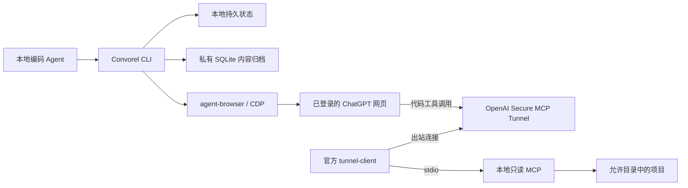

# 使用指南

从浏览器连接到代码访问、会话恢复与资源清理。本指南保留完整的命令和配置说明；项目介绍见 [README](../README.md)。

## 两条独立通道



| 使用方式            | 需要什么                                                       | ChatGPT 能看到什么       |
| ------------------- | -------------------------------------------------------------- | ------------------------ |
| 网页对话            | 已登录浏览器、CDP、可用模型                                    | 你发送的提示词和上下文   |
| 网页对话 + 本地代码 | 上述条件，以及 tunnel-client、隧道凭据和 ChatGPT developer app | 允许目录中通过过滤的内容 |

**仅打开 CDP 不会启用代码访问。** 网页对话无需本项目使用 API key；隧道需要自己的 runtime API key。无需 OpenAI 桌面端、Herdr 或记忆服务，也不需要全局安装 agent-browser。

## 快速开始

首版支持 **Linux（x64 / arm64，glibc）**，需要 Git 和已安装的 Google Chrome；从源码运行另需 Bun ≥ 1.3、Node ≥ 24。当前仅实现 ChatGPT 网页适配。

### 1. 安装

```bash
curl -fsSL https://raw.githubusercontent.com/MarioJames/convorel/main/install.sh | bash
```

安装脚本下载当前架构的 Release 压缩包，按该版本的 `sha256sums.txt` 校验后解压到 `~/.local/lib/convorel`，并把 `convorel` 与固定版本的 `agent-browser` 链接到 `~/.local/bin`；不使用 sudo。仅支持参数 `--version vX.Y.Z`、`--prefix PATH`、`--bin-dir PATH`、`--dist-dir PATH`、`--uninstall`、`--release-base URL`，安装选项不接受环境输入。卸载只移除可执行文件，不动会话状态、偏好和已安装技能。产物带 GitHub 构建来源证明，可用 `gh attestation verify 压缩包 --repo MarioJames/convorel` 核验。

从源码运行时：`git clone https://github.com/MarioJames/convorel.git`，以下命令把 `convorel` 换成 `bun --no-env-file src/cli.ts`，初始化改用 `bun --no-env-file setup.ts`（它会先执行 `bun install --frozen-lockfile`）。

### 2. 准备浏览器

在另一个终端启动 Chrome，随后手动登录 ChatGPT；已有 Convorel 专用的有头 Chrome CDP 会话可以直接复用。验收侧 browser-harness 使用独立的自带 Chromium + 无头模式，其配置、session 和 profile 不用于这里。

```bash
google-chrome --remote-debugging-address=127.0.0.1 --remote-debugging-port=9222 \
  --user-data-dir="$HOME/.local/share/convorel-chrome" https://chatgpt.com
```

将 `google-chrome` 换成实际安装的浏览器命令。调试端口只绑定本机，并使用单独的持久化 profile；[Chrome 136+ 要求使用非默认数据目录](https://developer.chrome.com/blog/remote-debugging-port)。

### 3. 初始化

将 `--workspace` 替换为代码工作区的绝对路径：

```bash
convorel setup --workspace /absolute/path/to/your-project --cdp 9222
```

`setup` 将配置写入 `~/.local/share/convorel/`，并检查 CDP 和本地 MCP（源码方式还会先安装锁定的本地依赖）。模型和项目偏好仅从 `convorel config` 管理的偏好文件读取，新任务保存当时的配置。

`--workspace` 保存默认代码工作区；未配置 `mcp.roots` 时，它也是唯一允许读取的目录。配置多目录后，对话中直接提供目标项目的完整路径即可。

模型默认选择 **Latest 的 Power 末端 Pro**，不锁定版本；可用 `convorel config set model MODEL` 明确覆盖，程序每次发送前核验，不静默降级。对于其他可见模型，先在网页中手动选好。所有源码 CLI 命令保留 `--no-env-file`，避免自动加载调用目录或共享工作区的环境文件；Convorel 自身只读取配置文件，不接受环境覆盖。

### 4. 发起第一次讨论

直接使用 CLI，先创建一个不含敏感信息的请求文件。文件内容由调用方完整编写：

```bash
review_prompt_file=$(mktemp)
cat > "$review_prompt_file" <<'PROMPT'
请解释内容哈希如何帮助识别文件变化。
给出一个简短示例。
PROMPT

bun --no-env-file src/cli.ts conversation start \
  --id first-question --prompt-file "$review_prompt_file" \
  --type EXP --topic '内容哈希'
```

从输出中复制 `currentRun`，将下面的 `RUN_ID` 替换为该值：

```bash
bun --no-env-file src/cli.ts conversation wait --id first-question --run RUN_ID
bun --no-env-file src/cli.ts conversation result --id first-question --run RUN_ID
bun --no-env-file src/cli.ts conversation finish --id first-question --run RUN_ID
```

先消费、保存回复，再执行 `finish`。它保留会话链接和结果，只关闭经过核验的自有标签页；用户原有标签页不会关闭。

## 配置文件与目录

入口为 `convorel [--config-dir PATH] [--state-dir PATH] COMMAND`。全局目录参数必须放在命令前：

```bash
convorel --config-dir /private/config --state-dir /private/state config list
convorel --config-dir /private/config --state-dir /private/state conversation list
```

默认偏好文件为 `~/.config/convorel/preferences.json`，默认任务状态目录为 `~/.local/share/convorel`。`--config-dir` 选择存放 `preferences.json` 的目录，`--state-dir` 选择持久状态目录；两者均应在 MCP 允许根之外。自定义目录时，后续命令和后台等待进程沿用同一组参数。

配置只从偏好文件读取，不接受环境覆盖。用 `config path` 查看文件位置，`config list`/`config get KEY` 查看配置，`config set KEY VALUE` 写入，`config unset KEY` 删除。配置键如下：

| 配置键                         | 含义                                                   |
| ------------------------------ | ------------------------------------------------------ |
| `model`                        | 模型选择；未设置时使用 Latest + Power 末端 Pro         |
| `project.url` / `project.name` | 目标项目 URL 与名称，必须成对配置                      |
| `tunnel.id`                    | 默认隧道 ID；单次命令可用 `--tunnel-id` 指定           |
| `tunnel.apiKey`                | 隧道运行时密钥，配置输出不回显                         |
| `mcp.roots`                    | 允许读取的目录 JSON 数组                               |
| `browser.executable`           | agent-browser 控制器的可执行文件路径，不是 Chrome 路径 |
| `browser.serial`               | `true` 使用全局浏览器操作锁；`false` 按任务并行        |
| `locks.taskWaitMs`             | 同任务操作锁的最大等待毫秒数，正整数                   |
| `release.baseUrl`              | 版本检查与升级的发布下载基址，HTTP(S) URL              |

例如 `convorel config set browser.serial true`、`convorel config set locks.taskWaitMs 15000`。新任务读取当前配置并保存 snapshot；已有任务续谈保持原模型、项目等快照，修改配置不会迁移旧任务。

## 升级与版本检查

```bash
convorel version --check
convorel upgrade
convorel upgrade --version vX.Y.Z
```

`version --check` 返回当前版本、`latest` 和 `upToDate`。独立安装的 `upgrade` 复用内嵌安装脚本，下载并验证 checksum 和可执行文件版本后切换安装链接，保留旧版本、会话、偏好与技能。自定义安装目录由安装器的 `layout.json` 记录；无法识别布局时提示重新运行安装器。源码方式提示在仓库执行 `git pull` 和 `bun install --frozen-lockfile`。升级不自动重启已有后台进程，需要使用新版时运行 `convorel restart`。`upgrade` 的 `skills.status=check-required` 提示只表示需显式检查技能，不代表已扫描或同步安装；运行时已是最新版时也返回此提示。

## 安装与更新审查技能

Convorel 内置技能安装命令，支持 Codex 和 Claude Code，也可用 `--agent codex,claude-code` 同时安装。此入口无需先初始化浏览器或任务配置，`--scope` 默认 `user`：

```bash
bun --no-env-file src/cli.ts skills install --agent codex --scope user
# 安装到自定义技能根目录，生成 /absolute/custom-skills/chatgpt-review
convorel skills install --dir /absolute/custom-skills
# 仅安装到指定项目
bun --no-env-file src/cli.ts skills install --agent claude-code --scope project --cwd /absolute/path/to/project
```

安装入口直接复制本安装包内置的完整技能资源；预检公共 `.agents/skills` 及所选 Agent 的目标路径（包含旧 `.codex/skills`），发现同名目录或链接就拒绝覆盖，安装后核验技能入口。也可在初始化时增加 `--agent codex`，例如 `bun --no-env-file setup.ts --workspace /absolute/path/to/project --cdp 9222 --agent codex`：初始化后安装技能，再执行 doctor。省略 `--agent` 不安装技能。

`--dir` 与 `--agent`、`--scope`、`--cwd` 互斥，同样拒绝覆盖已有技能，不创建 Agent 专用链接。

运行时升级后，使用新版 CLI 和原安装目标显式同步；不会自动扫描其他用户目录或项目：

```bash
convorel skills check --agent codex --scope user
convorel skills update --agent codex --scope user
convorel skills check --dir /absolute/custom-skills
convorel skills update --dir /absolute/custom-skills
# legacy 安装：提供真实旧版本的 bundled skill 目录，先检查再更新
convorel skills check --agent codex --scope user --baseline-dir /private/old-release/skills/chatgpt-review
convorel skills update --agent codex --scope user --baseline-dir /private/old-release/skills/chatgpt-review
```

`check` 只读，不建立配置、状态或安装目录。输出 `status`（`current` / `update-available` / `conflict` / `unmanaged` / `missing`）、`baselineVersion`、`bundleVersion`、`changes`、`localChanges` 与 `conflicts`。`current` 表示安装基线与当前内置资源一致，可仍保留本地定制；检查非 current 退出 2。`update` 更新或已 current 退出 0，有冲突/无基线/未安装退出 2，参数或操作异常退出 1。

新安装在技能内记录 `.convorel-skill.json`（版本和各文件 SHA-256），不建立另一套全局配置。按旧基线、本地和新版进行文件级比较：仅上游修改应用，仅本地修改保留，双方修改同一文件且内容不同时整次拒绝。删除与文件/目录转换也参与冲突检查，额外个人文件保留。先备份并人工协调 `conflicts`，再执行 update；没有强制覆盖参数。不要删 manifest 绕过保护。所有选定 Agent 的链接必须仍指向同一 canonical 技能；异常链接或树内符号链接会停止更新，不跟随到其他目录。

无 manifest 的旧安装若完整匹配当前内置资源，可直接 update 记录基线；否则需 `--baseline-dir` 指向可信旧版源码/发布包中的 **chatgpt-review 技能目录本身**，不可用当前定制目录或猜测版本充当基线。该选项仅用于无 manifest 的旧安装。旧版不可确认时，保留现有目录，用独立临时安装导出新版人工比对。

更新沿用安装器的暂存、切换、失败回滚模式，技能全树准备完成后再切换目录，普通切换错误恢复旧目录及基线。切换有两次 rename 之间的短暂路径空窗，应避开其他 Agent 同时加载或编辑技能。崩溃/回滚失败会保留目标旁 `.chatgpt-review.convorel-lock` 的 `owner.json`、`previous` 和 `staged`，后续操作报 `SKILL_UPDATE_LOCKED`。先确认属主进程已结束并保存现场；目标缺失且 previous 完整时恢复 previous 为原目标，目标存在时先核验 manifest/内容，不能直接覆盖。恢复核验后才精确清理该次锁目录，不删除唯一恢复副本。已加载旧技能的 Agent 需要重新加载或新建会话。

在 Convorel 源码目录中也可使用现有 Skills CLI：

```bash
bunx skills add ./skills --skill chatgpt-review -a codex -g
```

`-g` 表示用户范围；直接使用 Skills CLI 时保留交互确认，遇到同名个人技能应取消覆盖；包装入口会预先拒绝此类冲突。源码发布后也可将 `./skills` 换为 `https://github.com/MarioJames/convorel`。安装技能不安装 Convorel 运行时；技能直接使用 `PATH` 中的 `convorel`（安装脚本默认链接到 `~/.local/bin`），源码方式可显式调用 `bun --no-env-file /path/to/convorel/src/cli.ts`，不从技能目录推断运行时。

审查目标用 `convorel config` 保存到 `~/.config/convorel/preferences.json`（`convorel config path` 显示位置，`config list` 查看来源）：

```bash
convorel config set project.url https://chatgpt.com/g/g-p-实际项目ID/project
convorel config set project.name 实际项目名称
# 可选：convorel config set model '用户明确选择的模型'
```

URL 必须来自实际项目页面，URL/name 成对配置。配置项目后直接在该项目的“新建对话”输入框创建；项目入口不匹配则在发送前停止，不在普通会话中创建后移动。标题使用 `MMDD｜TYPE｜Topic`，日期来自会话 `createdAt` 转 `Asia/Shanghai`；默认英文 TYPE，明确要求中文时用 `start --language zh`。创建时通过 `--type`/`--topic` 提供命名信息，首条消息与持久化 URL 确认后立即改名，不等待回复完成；主题不明时省略命名参数，保留原标题。URL 延迟时 `resume`/`wait` 会补做尚未开始的命名。命名失败独立记录在 `organization.error`，检查后用 `organize --id ID --run RUN_ID --type EXP --topic '具体主题'` 显式恢复，不重发消息；命名只改标题，项目归属不符则报错。配置仅来自偏好文件。新 task 保存配置 snapshot，续谈保留原模型/项目，修改配置不会改写旧 task。

技能会整理证据、处理意见并清理已完成的自有标签页。等待可以使用宿主后台进程或分段 CLI wait；Herdr 可用时才增强为 service lane，无需安装 Herdr 或记忆服务。

## 让 ChatGPT 读取本地代码

本地 MCP 使用 **stdio**，由 MCP 客户端或官方 tunnel-client 启动，不是浏览器直接访问的 HTTP 服务。

### 1. 准备隧道与凭据

安装官方 [tunnel-client](https://github.com/openai/tunnel-client/releases/latest)，确保命令在 `PATH` 中。在 [Platform 隧道设置](https://platform.openai.com/settings/organization/tunnels) 创建隧道，并关联目标 ChatGPT 工作区。在同一组织的 [Runtime API keys](https://platform.openai.com/settings/organization/api-keys) 创建具有 **Tunnels Read + Use** 权限的运行时密钥。

### 2. 配置凭据与读取范围

用 `convorel config` 保存凭据和读取范围；密钥写入 0600 的偏好文件，`config get`/`config list` 只显示是否已配置，不回显：

```bash
convorel config set tunnel.apiKey 你的_OpenAI_运行时密钥
convorel config set tunnel.id tunnel_你的隧道ID
convorel config set mcp.roots '["~/workspaces","~/opensource"]'
```

`mcp.roots` 是允许读取的根目录 JSON 数组，支持绝对路径和 `~/`。未设置时使用初始化时指定的目录；根目录不能重复、嵌套或是符号链接。修改读取范围后需重启隧道。

隧道 ID 可用 `--tunnel-id` 覆盖配置文件中的 `tunnel.id`。源码命令保留 `--no-env-file`，独立可执行文件已内置该行为。

密钥保存在私有偏好文件中，只在启动官方客户端时映射为它需要的 `CONTROL_PLANE_API_KEY`，不写入提示词或任务 JSON；配置时注意避免 shell 历史记录泄露密钥。

### 3. 启动并连接 ChatGPT

```bash
bun --no-env-file src/cli.ts tunnel instructions
bun --no-env-file src/cli.ts tunnel doctor
bun --no-env-file src/cli.ts tunnel run
```

日常可使用顶层命令在后台管理官方 tunnel-client：

```bash
convorel start
convorel status
convorel logs --lines 100
convorel logs --follow
convorel restart
convorel stop
```

这些命令均可加 `--tunnel-id ID`，否则使用已配置的 ID。`start` 等待本地进程注册并短暂稳定，重复调用不会多开；`status` 的 `running` 只表示本地进程存活，不代表云端连接已验证。`stop` 按注册表中的进程身份停止客户端及其进程组，保留状态与日志；配置文件或代码目录丢失后仍可停止。`logs --follow` 用 Ctrl+C 退出。日志在 `~/.local/share/convorel-tunnels/`，每次启动保留上一份为 `.log.previous`。后台进程随当前登录环境运行，不注册系统开机服务，也不管理 Chrome。

需要前台运行时继续使用 `tunnel run`。在 [ChatGPT Plugins](https://chatgpt.com/plugins) 创建 developer app，选择 **Connection → Tunnel** 和对应隧道；当前本地 MCP 不提供应用层 OAuth，认证选择 **No Auth**。隧道连接仍受运行时密钥和工作区权限控制。随后在审查对话中启用该 app。一个 stdio 隧道 ID 同时只能运行一个客户端。

完整接入步骤见[接入指南](quickstart.md#code-access-through-a-tunnel)与 [OpenAI 官方文档](https://developers.openai.com/api/docs/guides/secure-mcp-tunnels)。

### 4. 按完整路径读取并验证

对话中直接给出项目路径，例如：

> 请审查 `/home/your-name/workspaces/my-project`。先调用 workspace_info 核对目录，再读取相关文件；引用文件路径和返回的 SHA-256。

| MCP 工具           | 用途                                                                             |
| ------------------ | -------------------------------------------------------------------------------- |
| `workspace_info`   | 允许根、项目身份、HEAD/分支、Git 可用性，以及实际服务版本、能力版本和工具清单    |
| `tree`             | 结构化目录条目和目录树文本，明确深度、扫描限制及分页；取代独立目录列表           |
| `find_files`       | 按文件名或相对路径 glob 定位文件，支持深度及分页                                 |
| `read_file`        | 按行读取当前 UTF-8 文件、文档或文本报告，返回整文件 SHA-256                      |
| `search_workspace` | 在指定目录和文件 glob 内搜索字面量，返回匹配行、上下文、文件 hash 和续读位置     |
| `read_image`       | 按需读取 PNG/JPEG/WebP 截图或图片，返回原生 MCP 图片内容及 hash，最大 1 MiB      |
| `git_status`       | 分页读取经过路径过滤的工作区状态                                                 |
| `git_diff`         | 工作区/暂存区/相对 HEAD 的文件清单和可续读的单文件 patch                         |
| `git_log`          | 分页查看提交历史、提交身份、作者及父提交，标明浅克隆限制                         |
| `git_show`         | 查看一次提交的元信息、完整提交说明、文件统计和可续读 patch；合并提交可选择父提交 |
| `git_compare`      | 比较两个版本，区分端点差异与从共同祖先起的变化                                   |
| `git_read_file`    | 按行读取指定提交中的文件，包括当前已经删除的文件                                 |

工具使用完整 `path`，支持绝对路径和 `~/`；Git 工具的 `path` 必须是真实仓库根目录，`filePath`/`patchFile` 是仓库相对路径。远端不能增加允许根或扩大本地配置。所有工具声明严格 MCP `outputSchema` 并返回对应的 `structuredContent`；图片另附原生 image 内容。

`workspace_info` 不传路径时返回 `workspace: null` 和允许根 `{ path, rootId }`；传目录路径时返回所属工作区详情。`server.capabilityVersion` 为 `evidence-v2`，`server.tools` 反映当前进程实现。连接器缓存旧定义时，在插件管理页面刷新工具定义；仅重启本地进程不能证明客户端缓存已经刷新。

所有工具统一返回 `rootId`（配置的允许根）、`workspaceId` 和 `workspacePath`（所属工作区的 ID 与完整路径）；`workspace_info` 将后三个字段放在 `workspace` 内。工作区取允许根内最近的 `.git` 标记所在目录，兼容普通仓库、嵌套仓库和 Git worktree；没有标记时使用允许根，不向允许根外追溯。标记仅用于归属识别，不证明 Git 可用，Git 操作仍执行原有存储边界检查。读取同一仓库的文件、子目录和 Git 历史时，工作区 ID 保持一致；`path` 仍表示本次查询范围，相对文件名仍相对于该范围。允许根包含多个仓库时，在根上查询表示整个根的范围，不宣称所有结果属于某个子仓库。ID 仅用于证据关联，不用于认证；目录移动或仓库边界变化后应重新核对身份。

### 按问题取证

- **找入口或配置**：`tree` 看布局，`find_files(path, pattern)` 找文件。无 `/` 的模式匹配任意深度的文件名，例如 `*.ts`；有 `/` 则匹配相对路径，例如 `src/**/*.ts`。`tree` 提供文件层次，不证明依赖关系或架构正确性。
- **核实实现**：`search_workspace(path, query, pattern, contextLines)` 返回区分大小写的字面量匹配；按 `nextOffset` 续查，用 `read_file` 展开关键上下文。`textTruncated` 表示摘录不完整。`scanTruncated`、`depthLimited` 或 `skippedFiles` 非零时，不能断言“整个项目不存在”；缩小目录/文件范围或调整深度后再查。
- **最近改了什么**：先 `git_log(path, limit)`，再 `git_show(path, ref)`；工作区干净和相对 HEAD 的 diff 为空，只代表当前未提交变更情况。首次提交比较空树，合并提交默认比较第一父提交，可指定 `parent`。
- **交付相对基线改了什么**：`git_compare(path, base, head, mode)`，`mode=direct` 比较两个端点；`mode=merge-base` 比较共同祖先到 head。用返回的完整 SHA 固定后续调用，并通过 `git_read_file(path, ref, filePath)` 读取对应版本，避免混用当前文件。
- **验证依据是什么**：本地 Agent 提供目标、约束、比较基线、实际结果和验证摘要，需要时再用 `read_file` 读取报告/日志，用 `read_image` 读取截图。产物路径必须已获准共享并通过相同忽略规则；不要为了报告开放整个私有任务目录。工具不执行测试，文件/截图 hash 也不证明它对应哪次运行；摘要应注明执行命令、版本、时间和结果。

### 完整性与续读

文本及结构化 JSON 每次最多 64 KiB；图片二进制单独限制为 1 MiB。当前文本文件最大 1 MiB，非 UTF-8、二进制和超长单行会显式失败，不伪装成空内容。按返回的 `nextStartLine`、`nextOffset` 继续；扫描受限的范围不能仅靠翻页补全。

Git 差异先返回文件清单和一份 patch。使用文件页的 `nextOffset` 获取其余文件，指定 `patchFile` 查看该文件，按 patch 的续读位置读取后续片段。提交说明使用 `message.nextOffset` 配合 `messageOffset` 续读；历史差异使用 `patch.nextOffset`，工作区差异使用 `nextPatchOffset`；偏移为 UTF-16 code unit，请原样使用返回值。历史分页固定返回的提交 SHA；这不会冻结当前忽略策略，发现策略或可见文件清单变化时应丢弃已组合的分页并重新读取，无法确认完整性时注明证据不足。工作区分页还须核对 `patchSha256`，变化后重新读取。统计范围、隐藏文件和截断信息必须保留在审查结论里。Git 命令达到进程或输出预算时显式报错，不返回“没有修改”。

当前文件、目录及检索是实时观察，时间戳和 hash 标识已读取证据；HEAD 不能代表未提交内容的快照。历史文件与差异同时受当前及对应历史版本的忽略规则约束。历史记录中的普通文本仍可能包含秘密；文件名规则不是通用秘密扫描器。

首次连接时，在允许目录内创建一个内容已知、无敏感信息的测试文件，让 ChatGPT 调用 `read_file`，再用本地 `sha256sum /完整路径/测试文件` 比对整文件 hash 和内容。`tunnel doctor` 成功只说明本地检查通过，网页实际调用成功才确认整条链路可用。

## 续谈、恢复和多工作区

```bash
# 查看已保存的任务和轮次
bun --no-env-file src/cli.ts conversation list
bun --no-env-file src/cli.ts conversation status --id first-question --run RUN_ID

# 只观察现有消息，恢复中断后的状态，不再次点击发送
bun --no-env-file src/cli.ts conversation resume --id first-question --run RUN_ID

# 消费上一轮结果后，用新的请求 ID 继续同一对话
bun --no-env-file src/cli.ts conversation followup \
  --id first-question --prompt-file /path/to/followup.md --request-id round-2
```

重复相同任务和请求不会重发；新问题使用 `followup` 和新请求 ID。后续操作使用它返回的新 `currentRun`。等待超时只停止本地监视，不会停止网页生成。

`start`、`retry`、`status`、`resume` 和 `list` 的任务输出包含 `summary`：`delivery` 区分 `not_attempted`、`unknown` 和 `confirmed`；`workspace`/`workspaceId` 显示任务绑定；`phase`、`lastObservedAt`、`observationError`、`nextAction` 说明当前阶段、最近读取和继续方式。`status` 读取本地保存状态，不宣称网页仍保持该状态。

所有 `conversation` 子命令支持 `--fields`，按逗号分隔的顶层字段名缩减 JSON，无需额外 Python 或 jq 管道：

```bash
convorel conversation status --id first-question --workspace /absolute/project \
  --fields id,currentRun,summary,workspaceMismatch
convorel conversation list --fields id,state,summary
convorel conversation wait --id first-question --run RUN_ID --fields id,runId,state,nextAction,error
convorel conversation result --id first-question --run RUN_ID --fields reply
```

省略时返回完整输出；列表逐项筛选，`wait` 每次报告均筛选，嵌套对象（例如 `summary`）完整保留。不存在的字段返回 `null`，不支持点路径、表达式或记录过滤。字段名只允许字母、数字、下划线，不能以数字开头；空字段或非法语法在执行操作前报错。筛选只影响 stdout，不改保存的数据、stderr 错误或退出码；即使省略 `workspaceMismatch`，绑定不匹配仍退出 2。`wait` 的状态字段位于顶层，`status` 的状态字段位于 `summary` 内。

`start`/`retry` 退出 0 表示已确认发送或已完成；`resume`/`wait` 仅完成时退出 0，未完成或需要处理时退出 2；`status` 退出 0 只表示读取本地状态成功。参数、锁等错误可退出 1。完整回复必须通过同一轮次的 `result` 取得。短暂观察失败最多连续尝试三次，期间保留已确认投递事实，不重复发送；登录、页面身份和草稿问题需要先检查处理。

新任务可以用 `conversation start --workspace /absolute/project` 显式保存任务工作区；省略时使用初始化的默认工作区，不从当前目录或 prompt 推断。`followup`/`retry --workspace PATH` 只断言已有绑定，发现不同就拒绝操作。`status --workspace PATH` 返回 `workspaceMismatch`，不匹配时退出 2，且不修改任务或页面。

尚未发送的首轮（`prepared`、无已确认消息和会话 URL）可显式修正绑定，保留原 run 和 prompt，不修改全局配置、不发送：

```bash
bun --no-env-file src/cli.ts conversation rebind-workspace \
  --id first-question --run RUN_ID \
  --from-workspace /previous/default --workspace /absolute/project
```

已发送或投递未知的轮次不允许改绑。应检查保存的 prompt 是否准确指定了实际项目和 revision，并继续观察同一 run；不要手改 JSON 或另建同需求任务。工作区绑定仅是任务元数据，不会改写 prompt、扩大 MCP 允许根或证明远端读取了代码。

新建页可能恢复旧草稿。普通 `retry` 会保留不匹配草稿并返回 `DRAFT_CHANGED`。先检查并备份完整草稿；仅在用户明确授权删除该副本后执行：

```bash
bun --no-env-file src/cli.ts conversation clear-draft \
  --id first-question --run RUN_ID --expected-draft-file /private/approved-draft.txt
bun --no-env-file src/cli.ts conversation retry --id first-question --run RUN_ID
```

`clear-draft` 只接受首轮尚未发送、没有历史消息的任务自有新建页。文件须逐字匹配当前草稿；命令先持久保存备份，再在页面内核对 URL、历史、附件、生成状态和草稿，触发编辑器删除并重新读取确认。变化后的草稿、借用页、提交中或投递未知轮次均拒绝清理。它不发送，也不会自动调用 retry；删除命令返回成功但未读回空草稿仍视为失败，保留现场。不要用 `fill("")` 的成功回执作为已清空证据。

同一允许范围内切换审查项目，在 prompt 中提供新的完整路径，并为新任务显式指定对应 `--workspace`，无需重新初始化。`--state-dir PATH` 用于隔离任务状态、默认工作区和 CDP 配置；`--config-dir PATH` 选择独立偏好文件，两者必须放在命令前。确需独立配置与状态时，使用 MCP 允许目录之外的持久私有目录，例如 `convorel --config-dir /private/config --state-dir /private/state setup --workspace /absolute/project --cdp 9222`。不同读取边界的连接应分别配置允许根和独立隧道。

完整命令见 `bun --no-env-file src/cli.ts --help`。

命名遇到首次改名交互之前的临时页面错误、元数据加载超时或 HTTP 429/5xx 时，`wait`/`resume` 自动恢复，总计最多 3 次，后两次间隔至少 5 秒、30 秒；重试次数与时间持久保存。`summary.organization` 单独报告核验状态、次数、错误与下一步，不把回复完成视为命名完成。权限错误、归属变化、标题保存结果不明或观察页清理未完成时停止自动重试，检查后可在原任务显式 `organize`。

监听同一轮回复持续 2 分钟无变化时，先检查会话身份、草稿和附件，再主动刷新原标签页并等待历史加载。刷新只恢复观察，不发送消息；刷新后按原用户消息 ID 判定完成、仍生成或已被后续消息取代。正常长时间思考不算失败，连续 3 次刷新失败则提示检查；`summary.completionProbe` 暴露停滞时间、刷新次数及错误。草稿和附件存在时保留原页并报告延期。`wait` 的总超时仍然生效。

仅首轮仍为 `prepared`、从未执行发送、且已记录的自有新建页确定丢失时，原任务的 `retry` 可重新创建页面（最多 2 次），继续同一个 run 与提示词。持久化会话暂时空白、用户消息已确认或投递未知，都不能作为重建并重发的证据。

## 会话内容归档与检索

任务 JSON 仍是运行真值；`STATE_DIR/conversations.db` 是内容归档，保存 prompt 原文、由回复自带「复制」按钮取得的 Markdown、每条内容的不可变版本、每轮选中的版本指针以及捕获缺口。轮次完成时自动写入，也可以显式操作：

```bash
bun --no-env-file src/cli.ts conversation archive --all true            # 从任务文档补齐投影
bun --no-env-file src/cli.ts conversation archive --id first-question
bun --no-env-file src/cli.ts conversation capture --id first-question --run RUN_ID
bun --no-env-file src/cli.ts conversation history --id first-question --run RUN_ID
bun --no-env-file src/cli.ts conversation search --query '防枚举' --role assistant --limit 5
bun --no-env-file src/cli.ts conversation content --version VERSION_UUID
bun --no-env-file src/cli.ts conversation export --directory /private/snapshot
bun --no-env-file src/cli.ts doctor --local true
```

- 完成、捕获和归档是独立结果：`state=complete` 不保证已有 Markdown 或数据库写入成功。完成路径返回 `task.archive`，本次 summary/wait 透传 `archive`，CLI `result` 补写本地归档后也返回 `archive`；`stored` / `partial` / `failed` / `unavailable` 与 `error`、`gaps` 独立披露归档结果。notice 不写 task JSON，纯读取 status 不隐式写档；不能把缺省 notice 当作成功。磁盘写满、SQL 拒绝或缺少 Copy 均不改变已完成状态、`nextAction=result` 或完成命令的成功退出码，也不授权重发。`archive` 与 `capture` 退出码为归档失败 → 1，有缺口或 `partial` → 2，其余 0；`doctor --local true` 在库自身完整性检查失败时退出 1，本地记录可读但不完整时退出 2。
- 内容只增不改。重新生成的回复、重新捕获的 Markdown 都追加为新的 `content_version`，轮次通过指针选择当前版本。`history` 给出每轮选中的正文和该轮全部版本元数据，`content --version UUID` 按版本 ID 读回任意一条正文（含已被取代的旧版本），这样旧引用今天仍可核对。
- 回复正文只认 Markdown：没有捕获到 Markdown 时 `history` 的 `reply` 为空、`capture_status` 为 `pending`，页面渲染文本单独保留在 `reply_rendered`，只用于追溯，不会被当作回复正文。检索覆盖每轮当前选定的 prompt 与「当前最佳正文」——已捕获时用 Markdown，未捕获时用渲染副本，命中结果的 `format` 字段披露是哪一种。
- 检索使用 FTS5 的 `trigram` 分词，中文子串可以直接命中；少于三个字符无法构成三元组时自动退化为 `instr` 字面量扫描。查询文本始终按字面量处理，FTS 语法字符不改变匹配语义；已被取代的旧版本不会混进命中，`--task`、`--role`、`--limit`（默认 20，上限 100）用于收窄，`--task` 时附带该任务的 coverage。
- `capture` 要求页面仍是同一会话、提交消息与目标回复都仍挂载、目标回复仍是最终态且渲染文本 hash 与保存的 `replyHash` 一致；点击复制后会再次读取页面并按渲染文本 hash 复核归属，正文变了记 `TARGET_CHANGED`，一次捕获窗口内出现多份不同正文记 `COPY_AMBIGUOUS`。复制控件点下去会短暂换成别的标签，使该轮在约两秒内被读成「非最终态」而正文不变，因此归属按正文判定，最终态只作有界等待（最多约 2.25 秒），不让下一次操作接手半途的页面。其他缺口原因码（例如 `COPY_BUTTON_MISSING`、`COPY_PAYLOAD_EMPTY`、`TARGET_NOT_RENDERED`）同样留在轮次上，`coverage` 汇总为 `current` / `markdown-incomplete` / `incomplete` / `unknown`；对已捕获且正文没变的轮次再执行一次会记为 `unchanged`，不算缺口。
- `export` 用 `VACUUM INTO` 产出一份独立、已通过 `integrity_check` 的一致性快照（直接复制活动文件会漏掉仍在 WAL 里已提交的字节）：写入过程关在本调用自建的 0700 暂存目录内，发布出的文件为 0600，返回路径、字节数和与系统 `sha256sum` 一致的 SHA-256，并拒绝覆盖已有目标、拒绝落在状态目录或 MCP 允许根内。**导出即扩散**：那份文件包含全部已归档的 prompt 与回复，按敏感数据管理。
- `history`/`search`/`content --from PATH` 读取指定路径（导出目录或改名后的快照文件），不读偏好、不要求工作区或浏览器；这些命令在 CLI 中先于配置与浏览器初始化派发，因此代码目录被删除、Chrome 已停止时仍能读回内容。写入类命令仍会先确认状态目录不在共享根内。
- 归档写入失败时先解决存储问题，再对同一轮 resume 或显式 archive。已完成且无待命名操作的 poll/resume 完全在本地补档；待命名时仍访问页面恢复组织并核验，但不重新 Copy 或替换已存回复。缺 Markdown 则需显式 capture，archive 不能生成缺失原文。
- 归档是任务文档的投影，可用 `archive --all true` 重建；Markdown 同时保存在任务文档中，所以两侧丢任意一侧，另一侧仍保有内容。重复导入相同文档不会新增版本，但会照实报告文档里仍缺的东西——「没写新内容」不等于「已经完整」。数据库和快照都留在私有状态目录，不进入 MCP 允许根，也不上传；当前没有提供按轮次删除内容的命令；不通过删库排障或处理捕获缺口。删除数据库会丢弃全部已归档内容和不可变版本，需要单独明确授权。

## 开发完成后的结果校验

功能完成且必要本地验证通过后，可以让 `chatgpt-review` 对照原目标、架构约束与实际交付，判断是否合理、有无偏移。提供最终行为、模块职责或数据流、主动调整及理由、关键文档/入口和验证摘要即可；不默认发送完整日志或深入逐文件审计。只有影响判断的具体疑点才通过只读 MCP 查看实现。

这类校验复用同一需求的会话，通常对最终交付版本进行一次。它不能代替本地测试，也不把方案阶段的审查当作实现结果已通过。技能根据交付规模和架构约束触发；普通文案、样式和沿用既有模式的小修正不自动增加审查。

## 访问边界

- 只读 MCP 没有文件写入或任意 shell 工具；所有允许根统一排除 `.env`、`.env.*` 和已有敏感文件规则覆盖的凭据文件；目录列表、搜索、读取和 Git 输出执行一致的过滤。符号链接、硬链接及越界路径会被拒绝，Git diff 同时检查重命名前后路径。
- 项目继承祖先目录的 `.convorelignore` 和 `.gitignore` 限制，子目录不能重新放行上层拒绝的路径；文件名规则不能识别写在普通源码里的所有秘密。
- 同一连接的授权客户端共享配置中允许目录的读取范围；任务 ID 和工作区 hash 不承担远端鉴权。
- 文件实时读取，hash 用于标识观察到的内容，不承诺跨文件不可变快照。
- 内容归档只写入私有状态目录，MCP 允许根不读取它；`conversation export` 会把全部已归档内容复制到你指定的目录，导出路径的选择由使用者负责。
- 网页 DOM、登录状态和平台权限可能变化；遇到验证挑战、草稿或不确定状态需要检查现场。

这是独立社区项目，不是 OpenAI 官方产品。分发源码不包含共享账号、隧道或公开 ChatGPT 插件。详细边界见[安全说明](security.md)。

## 开发与贡献

```bash
bun install --frozen-lockfile
bun run check
bun run format:check
bun run test:browser --chrome /path/to/installed/chrome
bun run test:package
```

浏览器回归使用一次性 profile，不登录账号、不发送 ChatGPT 消息。安装包验收覆盖含空格路径、项目目录外调用、内置技能及引用文件、打包的浏览器控制器和真实 MCP stdio 读取。具体测试环境及覆盖范围见[验证记录](validation.md)。

欢迎通过 [Issues](https://github.com/MarioJames/convorel/issues) 提供复现或建议；开发约定见 [CONTRIBUTING.md](../CONTRIBUTING.md)。

采用 [Apache-2.0](../LICENSE) 许可证。复用来源及第三方许可见 [NOTICE](../NOTICE) 和 [第三方声明](../THIRD_PARTY_LICENSES.md)。

### 显式恢复被 Cloudflare 拒绝的发送

DOM 中出现 user/marker 可能只是乐观插入，`delivery: confirmed` 目前表示识别到页面消息，不能独自证明服务器接受。若原发送 POST 被 Cloudflare challenge 拒绝，刷新原页后本轮 user 和 marker 均消失，可由操作者核实证据并明确授权一次恢复发送：

```bash
bun --no-env-file src/cli.ts conversation recover-send \
  --id TASK_ID --run RUN_ID \
  --expected-user-message OLD_USER_ID --expected-url SAVED_CONVERSATION_URL \
  --prompt-file original-input.md --evidence-file sanitized-network.json \
  --rejected-at UNIX_TIMESTAMP_MS --confirm-cloudflare-challenge true \
  --reason '已核实本轮发送被 Cloudflare challenge 拒绝；刷新原自有页面后消息消失，授权重发原 prompt'
```

`prompt-file` 必须是原始输入（不带 Convorel marker），与保存的 hash 逐字一致。证据文件是仅含 `method/url/status/timestamp` 的 JSON 数组，必须唯一包含 `POST https://chatgpt.com/backend-api/f/conversation`、`status: 403` 和指定毫秒时间。时间不得早于本轮发送时间（旧记录使用创建时间），不得在未来或复用已消费证据。`--confirm-cloudflare-challenge true` 是操作者对该请求响应为 `cf-mitigated: challenge`、HTML 挑战页的明确确认；工具不自行推断 403 的原因或证明证据归属。禁止提供原请求 headers、token 或未经脱敏的网络转储。

此命令只接受当前 `blocked`、曾记录 user ID 且没有本轮完成结果的后续轮次。它要求原 URL、仍有效的自有 target、空 composer、无附件/生成，并核验上一 complete run 的精确 user ID、唯一 run marker、回复 ID/hash 和完整分支。旧用户消息以身份锚点匹配，不将 Markdown 渲染后的页面正文与原输入逐字比较；保存原文的 hash 仍须完整一致。准备及发送前再次检查原消息/marker 缺失、历史、草稿和 target；不重开、不新建、不重新绑定页面。仅 DOM 缺失、一般网络失败、`waiting` 或 `delivery_unknown` 均不构成恢复依据。

恢复时优先用当前 run 已保存的 `observedModel` 核验模型，缺失才回退任务模型/默认策略；仍执行最大 Pro 强度检查和发送前第二次 `verify-only`，不会因未配置固定模型重新选择 Latest。

通过后在发送边界持久保存 `sendRecoveries`（旧 user ID、旧/新 attempt、原因、target/URL、四字段证据和操作者确认），继续使用同一 task/run/request/prompt，只点击一次。退出码与 `start` 相同；提交异常保留未知投递，不自动再发。发送前失败保留 `blocked` 和旧 user ID，已填入的草稿留待检查，不变成普通 `retry` 可用的 `prepared`。重复调用必须重新满足全部条件；旧证据不能授权另一次发送。普通 `retry`、`resume` 语义不变。

当前浏览器适配器没有与发送动作绑定的响应元数据观察，仍可能把新的乐观 DOM 消息标成 `confirmed`。恢复后必须由同一 run 的 `resume`/`result` 确认完整回复；不能把命令退出 0 当作业务审查已完成。
