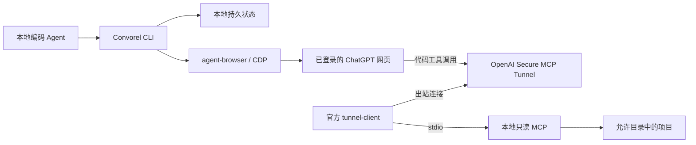

# 使用指南

从浏览器连接到代码访问、会话恢复与资源清理。本指南保留完整的命令和配置说明；项目介绍见 [README](../README.md)。

## 两条独立通道



| 使用方式            | 需要什么                                                       | ChatGPT 能看到什么       |
| ------------------- | -------------------------------------------------------------- | ------------------------ |
| 网页对话            | 已登录浏览器、CDP、可用模型                                    | 你发送的提示词和上下文   |
| 网页对话 + 本地代码 | 上述条件，以及 tunnel-client、隧道凭据和 ChatGPT developer app | 允许目录中通过过滤的内容 |

**仅打开 CDP 不会启用代码访问。** 网页对话无需本项目使用 API key；隧道需要自己的 runtime API key。无需 OpenAI 桌面端、Herdr 或记忆服务，也不需要全局安装 agent-browser。

## 快速开始

首版支持 **Linux**，需要 Bun ≥ 1.3、Node ≥ 24、Git 和已安装的 Google Chrome。当前仅实现 ChatGPT 网页适配。

### 1. 获取项目

```bash
git clone https://github.com/MarioJames/convorel.git
cd convorel
```

以下步骤使用源码安装。

### 2. 准备浏览器

在另一个终端启动 Chrome，随后手动登录 ChatGPT；已有 Convorel 专用的有头 Chrome CDP 会话可以直接复用。验收侧 browser-harness 使用独立的自带 Chromium + 无头模式，其配置、session 和 profile 不用于这里。

```bash
google-chrome --remote-debugging-address=127.0.0.1 --remote-debugging-port=9222 \
  --user-data-dir="$HOME/.local/share/convorel-chrome" https://chatgpt.com
```

将 `google-chrome` 换成实际安装的浏览器命令。调试端口只绑定本机，并使用单独的持久化 profile；[Chrome 136+ 要求使用非默认数据目录](https://developer.chrome.com/blog/remote-debugging-port)。

### 3. 初始化

在 Convorel 目录执行，将 `--workspace` 替换为代码工作区的绝对路径：

```bash
bun --no-env-file setup.ts --workspace /absolute/path/to/your-project --cdp 9222
```

`setup` 会安装锁定的本地依赖，将配置写入 `~/.local/share/convorel/`，并检查 CDP 和本地 MCP。模型和项目偏好从环境配置读取，新任务保存当时的配置。

`--workspace` 保存默认代码工作区；未配置 `CONVOREL_MCP_ROOTS` 时，它也是唯一允许读取的目录。配置多目录后，对话中直接提供目标项目的完整路径即可，无需设置 `CONVOREL_WORKSPACE`。

模型默认选择 **Latest 的 Power 末端 Pro**，不锁定版本；可用 `CONVOREL_MODEL` 明确覆盖，程序每次发送前核验，不静默降级。对于其他可见模型，先在网页中手动选好。所有源码 CLI 命令保留 `--no-env-file`，避免自动加载调用目录或共享工作区的环境文件；Convorel 只按已知配置项读取安装根 `.env`。

### 4. 发起第一次讨论

直接使用 CLI，先创建一个不含敏感信息的请求文件。文件内容由调用方完整编写：

```bash
CONVOREL_PROMPT_FILE=$(mktemp)
cat > "$CONVOREL_PROMPT_FILE" <<'PROMPT'
请解释内容哈希如何帮助识别文件变化。
给出一个简短示例。
PROMPT

bun --no-env-file src/cli.ts conversation start \
  --id first-question --prompt-file "$CONVOREL_PROMPT_FILE" \
  --type EXP --topic '内容哈希'
```

从输出中复制 `currentRun`，将下面的 `RUN_ID` 替换为该值：

```bash
bun --no-env-file src/cli.ts conversation wait --id first-question --run RUN_ID
bun --no-env-file src/cli.ts conversation result --id first-question --run RUN_ID
bun --no-env-file src/cli.ts conversation finish --id first-question --run RUN_ID
```

先消费、保存回复，再执行 `finish`。它保留会话链接和结果，只关闭经过核验的自有标签页；用户原有标签页不会关闭。

## 安装审查技能

Convorel 提供现有 Skills CLI 的薄包装，支持 Codex 和 Claude Code，也可用 `--agent codex,claude-code` 同时安装。此入口无需先初始化浏览器或任务配置，`--scope` 默认 `user`：

```bash
bun --no-env-file src/cli.ts skills install --agent codex --scope user
# 仅安装到指定项目
bun --no-env-file src/cli.ts skills install --agent claude-code --scope project --cwd /absolute/path/to/project
```

包装入口固定使用 `skills@1.6.0` 从本安装包的 `skills` 目录安装；预检公共 `.agents/skills` 及所选 Agent 的目标路径（包含旧 `.codex/skills`），发现同名目录或链接就拒绝覆盖，安装后核验技能入口。也可在初始化时增加 `--agent codex`，例如 `bun --no-env-file setup.ts --workspace /absolute/path/to/project --cdp 9222 --agent codex`：初始化后安装技能，再执行 doctor。省略 `--agent` 不安装技能。

在 Convorel 源码或安装包目录中使用现有 Skills CLI：

```bash
bunx skills add ./skills --skill chatgpt-review -a codex -g
```

`-g` 表示用户范围；直接使用 Skills CLI 时保留交互确认，遇到同名个人技能应取消覆盖；包装入口会预先拒绝此类冲突。源码发布后也可将 `./skills` 换为 `https://github.com/MarioJames/convorel`。安装技能不安装 Convorel 运行时；让 `convorel` 在 `PATH` 中，或在 Agent 进程环境设置 `CONVOREL_BIN=/absolute/path/to/convorel/src/cli.ts`。技能会以 `bun --no-env-file` 执行该脚本，即使技能安装到另一个目录也无需相对路径。

可在 Convorel 安装根 `.env` 配置审查目标：

```dotenv
CONVOREL_PROJECT_URL=https://chatgpt.com/g/g-p-实际项目ID/project
CONVOREL_PROJECT_NAME=实际项目名称
# 可选：CONVOREL_MODEL=用户明确选择的模型
```

URL 必须来自实际项目页面，URL/name 成对配置。配置项目后直接在该项目的“新建对话”输入框创建；项目入口不匹配则在发送前停止，不在普通会话中创建后移动。标题使用 `MMDD｜TYPE｜Topic`，日期来自会话 `createdAt` 转 `Asia/Shanghai`；默认英文 TYPE，明确要求中文时用 `start --language zh`。创建时通过 `--type`/`--topic` 提供命名信息，首条消息与持久化 URL 确认后立即改名，不等待回复完成；主题不明时省略命名参数，保留原标题。URL 延迟时 `resume`/`wait` 会补做尚未开始的命名。命名失败独立记录在 `organization.error`，检查后用 `organize --id ID --run RUN_ID --type EXP --topic '具体主题'` 显式恢复，不重发消息；命名只改标题，项目归属不符则报错。同名进程环境变量包括空值都优先于安装根 `.env`。新 task 保存配置 snapshot，续谈保留原模型/项目，修改环境不会改写旧 task。

技能会整理证据、处理意见并清理已完成的自有标签页。等待可以使用宿主后台进程或分段 CLI wait；Herdr 可用时才增强为 service lane，无需安装 Herdr 或记忆服务。

## 让 ChatGPT 读取本地代码

本地 MCP 使用 **stdio**，由 MCP 客户端或官方 tunnel-client 启动，不是浏览器直接访问的 HTTP 服务。

### 1. 准备隧道与凭据

安装官方 [tunnel-client](https://github.com/openai/tunnel-client/releases/latest)，确保命令在 `PATH` 中。在 [Platform 隧道设置](https://platform.openai.com/settings/organization/tunnels) 创建隧道，并关联目标 ChatGPT 工作区。在同一组织的 [Runtime API keys](https://platform.openai.com/settings/organization/api-keys) 创建具有 **Tunnels Read + Use** 权限的运行时密钥。

### 2. 配置环境文件与读取范围

在 Convorel 安装目录复制 `.env.example` 为 `.env`（已有文件则直接编辑），填入自己的配置：

```dotenv
CONVOREL_TUNNEL_API_KEY=你的_OpenAI_运行时密钥
CONVOREL_TUNNEL_ID=tunnel_你的隧道ID
CONVOREL_MCP_ROOTS='["~/workspaces","~/opensource"]'
```

`CONVOREL_MCP_ROOTS` 是允许读取的根目录 JSON 数组，支持绝对路径和 `~/`。未设置时使用初始化时指定的目录；根目录不能重复、嵌套或是符号链接。修改读取范围后需重启隧道。

同名环境变量优先于 `.env`，包括显式空值；隧道 ID 还可用 `--tunnel-id` 覆盖。无论从哪个目录调用，程序只读取 Convorel 安装目录的 `.env`，不加载被审查项目的环境文件、`.env.local` 等变体，也不执行变量展开。保留命令中的 `--no-env-file`，由 Convorel 按上述规则加载配置。

`.env` 和 `.env.*` 已被 Git 忽略（保留可提交的 `.env.example` 模板）。可执行 `chmod 600 .env` 限制本机访问。密钥只在启动官方客户端时映射为它需要的 `CONTROL_PLANE_API_KEY`，不写入提示词或任务 JSON。

### 3. 启动并连接 ChatGPT

```bash
bun --no-env-file src/cli.ts tunnel instructions
bun --no-env-file src/cli.ts tunnel doctor
bun --no-env-file src/cli.ts tunnel run
```

保持 `tunnel run` 运行。在 [ChatGPT Plugins](https://chatgpt.com/plugins) 创建 developer app，选择 **Connection → Tunnel** 和对应隧道；当前本地 MCP 不提供应用层 OAuth，认证选择 **No Auth**。隧道连接仍受运行时密钥和工作区权限控制。随后在审查对话中启用该 app。一个 stdio 隧道 ID 同时只能运行一个客户端。

完整接入步骤见[接入指南](quickstart.md#code-access-through-a-tunnel)与 [OpenAI 官方文档](https://developers.openai.com/api/docs/guides/secure-mcp-tunnels)。

### 4. 按完整路径读取并验证

对话中直接给出项目路径，例如：

> 请审查 `/home/your-name/workspaces/my-project`。先调用 workspace_info 核对目录，再读取相关文件；引用文件路径和返回的 SHA-256。

| MCP 工具           | 用途                                                                             |
| ------------------ | -------------------------------------------------------------------------------- |
| `workspace_info`   | 允许根、项目身份、HEAD/分支、Git 可用性，以及实际服务版本、能力版本和工具清单    |
| `tree`             | 结构化目录条目和目录树文本，明确深度、扫描限制及分页；取代独立目录列表           |
| `find_files`       | 按文件名或相对路径 glob 定位文件，支持深度及分页                                 |
| `read_file`        | 按行读取当前 UTF-8 文件、文档或文本报告，返回整文件 SHA-256                      |
| `search_workspace` | 在指定目录和文件 glob 内搜索字面量，返回匹配行、上下文、文件 hash 和续读位置     |
| `read_image`       | 按需读取 PNG/JPEG/WebP 截图或图片，返回原生 MCP 图片内容及 hash，最大 1 MiB      |
| `git_status`       | 分页读取经过路径过滤的工作区状态                                                 |
| `git_diff`         | 工作区/暂存区/相对 HEAD 的文件清单和可续读的单文件 patch                         |
| `git_log`          | 分页查看提交历史、提交身份、作者及父提交，标明浅克隆限制                         |
| `git_show`         | 查看一次提交的元信息、完整提交说明、文件统计和可续读 patch；合并提交可选择父提交 |
| `git_compare`      | 比较两个版本，区分端点差异与从共同祖先起的变化                                   |
| `git_read_file`    | 按行读取指定提交中的文件，包括当前已经删除的文件                                 |

工具使用完整 `path`，支持绝对路径和 `~/`；Git 工具的 `path` 必须是真实仓库根目录，`filePath`/`patchFile` 是仓库相对路径。远端不能增加允许根或扩大本地配置。所有工具声明严格 MCP `outputSchema` 并返回对应的 `structuredContent`；图片另附原生 image 内容。

`workspace_info` 不传路径时返回 `workspace: null` 和允许根 `{ path, rootId }`；传目录路径时返回所属工作区详情。`server.capabilityVersion` 为 `evidence-v2`，`server.tools` 反映当前进程实现。连接器缓存旧定义时，在插件管理页面刷新工具定义；仅重启本地进程不能证明客户端缓存已经刷新。

所有工具统一返回 `rootId`（配置的允许根）、`workspaceId` 和 `workspacePath`（所属工作区的 ID 与完整路径）；`workspace_info` 将后三个字段放在 `workspace` 内。工作区取允许根内最近的 `.git` 标记所在目录，兼容普通仓库、嵌套仓库和 Git worktree；没有标记时使用允许根，不向允许根外追溯。标记仅用于归属识别，不证明 Git 可用，Git 操作仍执行原有存储边界检查。读取同一仓库的文件、子目录和 Git 历史时，工作区 ID 保持一致；`path` 仍表示本次查询范围，相对文件名仍相对于该范围。允许根包含多个仓库时，在根上查询表示整个根的范围，不宣称所有结果属于某个子仓库。ID 仅用于证据关联，不用于认证；目录移动或仓库边界变化后应重新核对身份。

### 按问题取证

- **找入口或配置**：`tree` 看布局，`find_files(path, pattern)` 找文件。无 `/` 的模式匹配任意深度的文件名，例如 `*.ts`；有 `/` 则匹配相对路径，例如 `src/**/*.ts`。`tree` 提供文件层次，不证明依赖关系或架构正确性。
- **核实实现**：`search_workspace(path, query, pattern, contextLines)` 返回区分大小写的字面量匹配；按 `nextOffset` 续查，用 `read_file` 展开关键上下文。`textTruncated` 表示摘录不完整。`scanTruncated`、`depthLimited` 或 `skippedFiles` 非零时，不能断言“整个项目不存在”；缩小目录/文件范围或调整深度后再查。
- **最近改了什么**：先 `git_log(path, limit)`，再 `git_show(path, ref)`；工作区干净和相对 HEAD 的 diff 为空，只代表当前未提交变更情况。首次提交比较空树，合并提交默认比较第一父提交，可指定 `parent`。
- **交付相对基线改了什么**：`git_compare(path, base, head, mode)`，`mode=direct` 比较两个端点；`mode=merge-base` 比较共同祖先到 head。用返回的完整 SHA 固定后续调用，并通过 `git_read_file(path, ref, filePath)` 读取对应版本，避免混用当前文件。
- **验证依据是什么**：本地 Agent 提供目标、约束、比较基线、实际结果和验证摘要，需要时再用 `read_file` 读取报告/日志，用 `read_image` 读取截图。产物路径必须已获准共享并通过相同忽略规则；不要为了报告开放整个私有任务目录。工具不执行测试，文件/截图 hash 也不证明它对应哪次运行；摘要应注明执行命令、版本、时间和结果。

### 完整性与续读

文本及结构化 JSON 每次最多 64 KiB；图片二进制单独限制为 1 MiB。当前文本文件最大 1 MiB，非 UTF-8、二进制和超长单行会显式失败，不伪装成空内容。按返回的 `nextStartLine`、`nextOffset` 继续；扫描受限的范围不能仅靠翻页补全。

Git 差异先返回文件清单和一份 patch。使用文件页的 `nextOffset` 获取其余文件，指定 `patchFile` 查看该文件，按 patch 的续读位置读取后续片段。提交说明使用 `message.nextOffset` 配合 `messageOffset` 续读；历史差异使用 `patch.nextOffset`，工作区差异使用 `nextPatchOffset`；偏移为 UTF-16 code unit，请原样使用返回值。历史分页固定返回的提交 SHA；这不会冻结当前忽略策略，发现策略或可见文件清单变化时应丢弃已组合的分页并重新读取，无法确认完整性时注明证据不足。工作区分页还须核对 `patchSha256`，变化后重新读取。统计范围、隐藏文件和截断信息必须保留在审查结论里。Git 命令达到进程或输出预算时显式报错，不返回“没有修改”。

当前文件、目录及检索是实时观察，时间戳和 hash 标识已读取证据；HEAD 不能代表未提交内容的快照。历史文件与差异同时受当前及对应历史版本的忽略规则约束。历史记录中的普通文本仍可能包含秘密；文件名规则不是通用秘密扫描器。

首次连接时，在允许目录内创建一个内容已知、无敏感信息的测试文件，让 ChatGPT 调用 `read_file`，再用本地 `sha256sum /完整路径/测试文件` 比对整文件 hash 和内容。`tunnel doctor` 成功只说明本地检查通过，网页实际调用成功才确认整条链路可用。

## 续谈、恢复和多工作区

```bash
# 查看已保存的任务和轮次
bun --no-env-file src/cli.ts conversation list
bun --no-env-file src/cli.ts conversation status --id first-question --run RUN_ID

# 只观察现有消息，恢复中断后的状态，不再次点击发送
bun --no-env-file src/cli.ts conversation resume --id first-question --run RUN_ID

# 消费上一轮结果后，用新的请求 ID 继续同一对话
bun --no-env-file src/cli.ts conversation followup \
  --id first-question --prompt-file /path/to/followup.md --request-id round-2
```

重复相同任务和请求不会重发；新问题使用 `followup` 和新请求 ID。后续操作使用它返回的新 `currentRun`。等待超时只停止本地监视，不会停止网页生成。

`start`、`retry`、`status`、`resume` 和 `list` 的任务输出包含 `summary`：`delivery` 区分 `not_attempted`、`unknown` 和 `confirmed`；`workspace`/`workspaceId` 显示任务绑定；`phase`、`lastObservedAt`、`observationError`、`nextAction` 说明当前阶段、最近读取和继续方式。`status` 读取本地保存状态，不宣称网页仍保持该状态。

所有 `conversation` 子命令支持 `--fields`，按逗号分隔的顶层字段名缩减 JSON，无需额外 Python 或 jq 管道：

```bash
convorel conversation status --id first-question --workspace /absolute/project \
  --fields id,currentRun,summary,workspaceMismatch
convorel conversation list --fields id,state,summary
convorel conversation wait --id first-question --run RUN_ID --fields id,runId,state,nextAction,error
convorel conversation result --id first-question --run RUN_ID --fields reply
```

省略时返回完整输出；列表逐项筛选，`wait` 每次报告均筛选，嵌套对象（例如 `summary`）完整保留。不存在的字段返回 `null`，不支持点路径、表达式或记录过滤。字段名只允许字母、数字、下划线，不能以数字开头；空字段或非法语法在执行操作前报错。筛选只影响 stdout，不改保存的数据、stderr 错误或退出码；即使省略 `workspaceMismatch`，绑定不匹配仍退出 2。`wait` 的状态字段位于顶层，`status` 的状态字段位于 `summary` 内。

`start`/`retry` 退出 0 表示已确认发送或已完成；`resume`/`wait` 仅完成时退出 0，未完成或需要处理时退出 2；`status` 退出 0 只表示读取本地状态成功。参数、锁等错误可退出 1。完整回复必须通过同一轮次的 `result` 取得。短暂观察失败最多连续尝试三次，期间保留已确认投递事实，不重复发送；登录、页面身份和草稿问题需要先检查处理。

新任务可以用 `conversation start --workspace /absolute/project` 显式保存任务工作区；省略时使用初始化的默认工作区，不从当前目录或 prompt 推断。`followup`/`retry --workspace PATH` 只断言已有绑定，发现不同就拒绝操作。`status --workspace PATH` 返回 `workspaceMismatch`，不匹配时退出 2，且不修改任务或页面。

尚未发送的首轮（`prepared`、无已确认消息和会话 URL）可显式修正绑定，保留原 run 和 prompt，不修改全局配置、不发送：

```bash
bun --no-env-file src/cli.ts conversation rebind-workspace \
  --id first-question --run RUN_ID \
  --from-workspace /previous/default --workspace /absolute/project
```

已发送或投递未知的轮次不允许改绑。应检查保存的 prompt 是否准确指定了实际项目和 revision，并继续观察同一 run；不要手改 JSON 或另建同需求任务。工作区绑定仅是任务元数据，不会改写 prompt、扩大 MCP 允许根或证明远端读取了代码。

新建页可能恢复旧草稿。普通 `retry` 会保留不匹配草稿并返回 `DRAFT_CHANGED`。先检查并备份完整草稿；仅在用户明确授权删除该副本后执行：

```bash
bun --no-env-file src/cli.ts conversation clear-draft \
  --id first-question --run RUN_ID --expected-draft-file /private/approved-draft.txt
bun --no-env-file src/cli.ts conversation retry --id first-question --run RUN_ID
```

`clear-draft` 只接受首轮尚未发送、没有历史消息的任务自有新建页。文件须逐字匹配当前草稿；命令先持久保存备份，再在页面内核对 URL、历史、附件、生成状态和草稿，触发编辑器删除并重新读取确认。变化后的草稿、借用页、提交中或投递未知轮次均拒绝清理。它不发送，也不会自动调用 retry；删除命令返回成功但未读回空草稿仍视为失败，保留现场。不要用 `fill("")` 的成功回执作为已清空证据。

同一允许范围内切换审查项目，在 prompt 中提供新的完整路径，并为新任务显式指定对应 `--workspace`，无需重新初始化。`CONVOREL_HOME` 用于隔离任务状态、默认项目和 CDP 配置；它不会自动隔离安装目录 `.env` 中的读取范围。确需独立状态时，将它设为允许目录之外的私有目录，再执行 `setup`。不同读取边界的连接应分别配置允许根和独立隧道。

完整命令见 `bun --no-env-file src/cli.ts --help`。

## 开发完成后的结果校验

功能完成且必要本地验证通过后，可以让 `chatgpt-review` 对照原目标、架构约束与实际交付，判断是否合理、有无偏移。提供最终行为、模块职责或数据流、主动调整及理由、关键文档/入口和验证摘要即可；不默认发送完整日志或深入逐文件审计。只有影响判断的具体疑点才通过只读 MCP 查看实现。

这类校验复用同一需求的会话，通常对最终交付版本进行一次。它不能代替本地测试，也不把方案阶段的审查当作实现结果已通过。技能根据交付规模和架构约束触发；普通文案、样式和沿用既有模式的小修正不自动增加审查。

## 访问边界

- 只读 MCP 没有文件写入或任意 shell 工具；所有允许根统一排除 `.env`、`.env.*` 和已有敏感文件规则覆盖的凭据文件；目录列表、搜索、读取和 Git 输出执行一致的过滤。符号链接、硬链接及越界路径会被拒绝，Git diff 同时检查重命名前后路径。
- 项目继承祖先目录的 `.convorelignore` 和 `.gitignore` 限制，子目录不能重新放行上层拒绝的路径；文件名规则不能识别写在普通源码里的所有秘密。
- 同一连接的授权客户端共享配置中允许目录的读取范围；任务 ID 和工作区 hash 不承担远端鉴权。
- 文件实时读取，hash 用于标识观察到的内容，不承诺跨文件不可变快照。
- 网页 DOM、登录状态和平台权限可能变化；遇到验证挑战、草稿或不确定状态需要检查现场。

这是独立社区项目，不是 OpenAI 官方产品。分发源码不包含共享账号、隧道或公开 ChatGPT 插件。详细边界见[安全说明](security.md)。

## 开发与贡献

```bash
bun install --frozen-lockfile
bun run check
bun run format:check
bun run test:browser --chrome /path/to/installed/chrome
bun run test:package
```

浏览器回归使用一次性 profile，不登录账号、不发送 ChatGPT 消息。安装包验收覆盖含空格路径、项目目录外调用、内置技能及引用文件、打包的浏览器控制器和真实 MCP stdio 读取。具体测试环境及覆盖范围见[验证记录](validation.md)。

欢迎通过 [Issues](https://github.com/MarioJames/convorel/issues) 提供复现或建议；开发约定见 [CONTRIBUTING.md](../CONTRIBUTING.md)。

采用 [Apache-2.0](../LICENSE) 许可证。复用来源及第三方许可见 [NOTICE](../NOTICE) 和 [第三方声明](../THIRD_PARTY_LICENSES.md)。

### 显式恢复被 Cloudflare 拒绝的发送

DOM 中出现 user/marker 可能只是乐观插入，`delivery: confirmed` 目前表示识别到页面消息，不能独自证明服务器接受。若原发送 POST 被 Cloudflare challenge 拒绝，刷新原页后本轮 user 和 marker 均消失，可由操作者核实证据并明确授权一次恢复发送：

```bash
bun --no-env-file src/cli.ts conversation recover-send \
  --id TASK_ID --run RUN_ID \
  --expected-user-message OLD_USER_ID --expected-url SAVED_CONVERSATION_URL \
  --prompt-file original-input.md --evidence-file sanitized-network.json \
  --rejected-at UNIX_TIMESTAMP_MS --confirm-cloudflare-challenge true \
  --reason '已核实本轮发送被 Cloudflare challenge 拒绝；刷新原自有页面后消息消失，授权重发原 prompt'
```

`prompt-file` 必须是原始输入（不带 Convorel marker），与保存的 hash 逐字一致。证据文件是仅含 `method/url/status/timestamp` 的 JSON 数组，必须唯一包含 `POST https://chatgpt.com/backend-api/f/conversation`、`status: 403` 和指定毫秒时间。时间不得早于本轮发送时间（旧记录使用创建时间），不得在未来或复用已消费证据。`--confirm-cloudflare-challenge true` 是操作者对该请求响应为 `cf-mitigated: challenge`、HTML 挑战页的明确确认；工具不自行推断 403 的原因或证明证据归属。禁止提供原请求 headers、token 或未经脱敏的网络转储。

此命令只接受当前 `blocked`、曾记录 user ID 且没有本轮完成结果的后续轮次。它要求原 URL、仍有效的自有 target、空 composer、无附件/生成，并核验上一 complete run 的精确 user ID、唯一 run marker、回复 ID/hash 和完整分支。旧用户消息以身份锚点匹配，不将 Markdown 渲染后的页面正文与原输入逐字比较；保存原文的 hash 仍须完整一致。准备及发送前再次检查原消息/marker 缺失、历史、草稿和 target；不重开、不新建、不重新绑定页面。仅 DOM 缺失、一般网络失败、`waiting` 或 `delivery_unknown` 均不构成恢复依据。

恢复时优先用当前 run 已保存的 `observedModel` 核验模型，缺失才回退任务模型/默认策略；仍执行最大 Pro 强度检查和发送前第二次 `verify-only`，不会因未配置固定模型重新选择 Latest。

通过后在发送边界持久保存 `sendRecoveries`（旧 user ID、旧/新 attempt、原因、target/URL、四字段证据和操作者确认），继续使用同一 task/run/request/prompt，只点击一次。退出码与 `start` 相同；提交异常保留未知投递，不自动再发。发送前失败保留 `blocked` 和旧 user ID，已填入的草稿留待检查，不变成普通 `retry` 可用的 `prepared`。重复调用必须重新满足全部条件；旧证据不能授权另一次发送。普通 `retry`、`resume` 语义不变。

当前浏览器适配器没有与发送动作绑定的响应元数据观察，仍可能把新的乐观 DOM 消息标成 `confirmed`。恢复后必须由同一 run 的 `resume`/`result` 确认完整回复；不能把命令退出 0 当作业务审查已完成。
